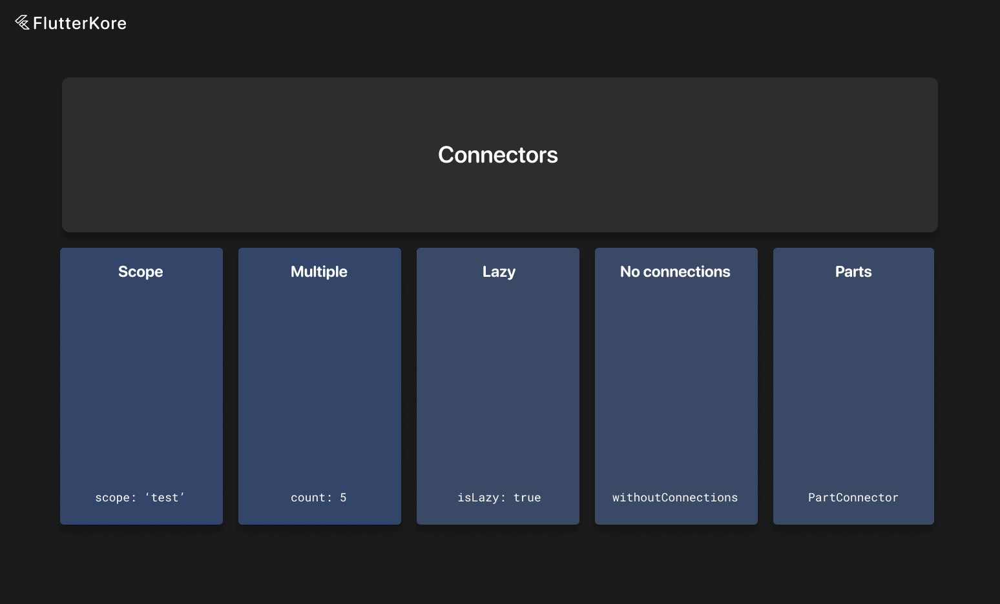

# Connectors



Connectors are objects that describe dependencies for flutter_kore instances.

We need to specify the type of instance we want to depend on.

We can also define the count of objects that we want to connect.

We can also specify the scope of the object. If you want a unique copy of an object, use `BaseScopes.unique` scope. By default, `BaseScopes.weak` is used.

If you mark a connector as lazy, the instance will be connected when accessed for the first time with `useLazyLocalInstance` and `useAsyncLazyLocalInstance`.

We can also specify if we want to connect an object without dependencies—in this case, the connected object won't be listening to `EventBus` events, and objects that this instance depends on also won't be connected. This is useful if you just want to use some method of a small instance.

Examples would be:

```dart
@override
DependentKoreInstanceConfiguration get configuration =>
    DependentKoreInstanceConfiguration(
      dependencies: [
        const Connector(type: SupportInteractor, scope: BaseScopes.unique), // unique instance
        const Connector(type: ShareInteractor, count: 5), // 5 unique instances
        const Connector(type: ReactionsWrapper), // shared instance
        // instance without connections, only works for unique instances
        const Connector(type: ReactionsWrapper, withoutConnections: true, scope: BaseScopes.unique),
        const Connector(type: ReactionsWrapper, scope: CustomScopes.test), // scoped instance
        const Connector(type: ReactionsWrapper, scope: CustomScopes.test, isLazy: true), // lazy scoped instance
      ],
    );
```

The library creates connectors for every single kore instance. This way you don't need to write `Connector` classes for every instance. You can just use predefined ones as follows:

```dart
@override
DependentKoreInstanceConfiguration get configuration =>
    DependentKoreInstanceConfiguration(
      dependencies: [
        app.connectors.postInteractorConnector(
          scope: BaseScopes.unique,
          input: input.post,
        ),
      ],
    );
```
### Part Connectors

Parts (you can read about parts [here](https://./instance_part.md)) are connected with `PartConnector`, which is a lightweight version of the base connector. This is because some settings of `Connector` are not needed for parts.

```dart
const PartConnector(type: TestInstancePart, isAsync: true, input: 6),
const PartConnector(type: LoadUsersInstancePart),
const PartConnector(type: SharePart, count: 5), // 5 unique parts
// part without connections
const PartConnector(type: LikeUserPart, withoutConnections: true),
```

The library creates connectors for every part too. This way you don't need to write `PartConnector` classes for every part. You can just use predefined ones as follows:

```dart
@override
DependentKoreInstanceConfiguration get configuration =>
  DependentKoreInstanceConfiguration(
    parts: [
      app.connectors.downloadUserPartConnector(
        input: input.id,
        isAsync: true,
      ),
      app.connectors.followUserPartConnector(input: input.id),
    ],
  );
```
