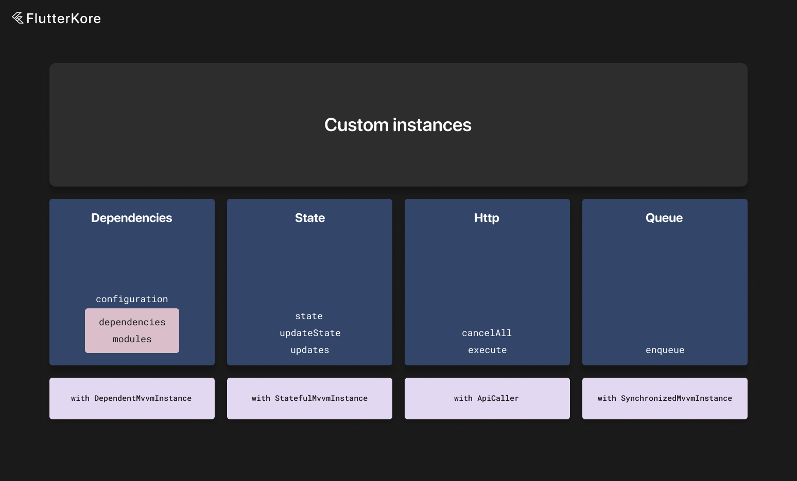

# Custom flutter_kore Instances



You can create custom kore instances by extending `BaseKoreInstance`. There are also predefined mixins for main functions like dependencies and state.

You also need to specify the input type for custom instances. It is passed as a generic argument.

Input is always available via the `input` field.

You can read about default methods of `BaseKoreInstance` [here](./kore_instance.md).

Here we will discuss mixins.

There are mixins that allow you to add additional functions to your custom instance like dependencies, cancelable API calls, and state.

### StatefulKoreInstance

For example—if you need to add state to your custom kore instance—you can write this:

```dart
abstract class BaseBox<State> extends BaseKoreInstance<dynamic> with StatefulKoreInstance<State, dynamic> {
  String get boxName;

  late final hiveWrapper = app.instances.get<HiveWrapper>();

  @mustCallSuper
  @override
  void initialize(Input? input) {
    super.initialize(input);

    initializeStatefulInstance();
  }

  @mustCallSuper
  @override
  void dispose() {
    super.dispose();

    disposeStore();
  }
}
```

You need to add an initialization call to the `initialize` method and the `disposeStore` method to the `dispose` override.

Then you can extend this custom instance and use its state, receive updates, restore cache, etc.

```dart

@MappableClass()
class UsersBoxState with UsersBoxStateMappable {
  const UsersBoxState({
    this.id,
    this.users,
  });

  final String? id;
  final List<User>? users;
}

@basicInstance
class UsersBox extends BaseBox<UsersBoxState> {
  void updateUsers(List<User> users) {
    updateState(state.copyWith(users: users));
  }

  Stream<List<User>?> get usersStream => updates((state) => state.users);
}

class UsersListViewModel extends BaseViewModel<UsersListView, UsersListViewState> {
  @override
  DependentKoreInstanceConfiguration get configuration =>
    DependentKoreInstanceConfiguration(
      dependencies: [
        app.usersBoxConnector(isLazy: true),
      ],
    );

  late final usersInteractor = useLocalInstance<UsersBox>();

  @override
  void onLaunch() {
    // called with initState
    useLocalInstance<PostsInteractor>().loadPosts(0, 30);
  }

  Stream<StatefulData<List<Post>>?> get usersStream => usersInteractor.usersStream;

  @override
  PostsListViewState get initialState => PostsListViewState();
}
```
### DependentKoreInstance

If you need to add dependencies to your custom kore instance, you can do the following:

```dart

abstract class BaseBox extends BaseKoreInstance<dynamic> with DependentKoreInstance<dynamic> {
  String get boxName;

  late final hiveWrapper = app.instances.get<HiveWrapper>();

  @mustCallSuper
  @override
  void initialize(dynamic input) {
    super.initialize(input);

    initializeDependencies();
  }

  @mustCallSuper
  @override
  Future<void> initializeAsync() async {
    await initializeDependenciesAsync();

    // call this method at the end of async initialization
    await super.initializeAsync();
  }

  @mustCallSuper
  @override
  void dispose() {
    super.dispose();

    disposeDependencies();
  }
}
```

You need to add an initialization call to the `initialize` method and the `disposeDependencies` method to the `dispose` override.

You also need to add `initializeDependenciesAsync` in the `initializeAsync` method.

Then you can extend this custom instance and use dependencies, the `useLocalInstance` method, etc.

```dart

@basicInstance
class UsersBox extends BaseBox {
  @override
  DependentKoreInstanceConfiguration get configuration =>
    DependentKoreInstanceConfiguration(
      dependencies: [
        app.connectors.postInteractorConnector(
          scope: BaseScopes.unique,
          input: input.post,
        ),
      ],
    );

  late final postInteractor = useLocalInstance<PostInteractor>();
}
```
### ApiCaller

If you need to execute HTTP requests in your custom kore instance, you can add the `ApiCaller` mixin so that requests can be canceled automatically when the instance is disposed.

You can do it as follows:

```dart

abstract class BaseBox extends BaseKoreInstance<dynamic> with ApiCaller<dynamic> {
  String get boxName;

  late final hiveWrapper = app.instances.get<HiveWrapper>();

  @mustCallSuper
  @override
  void dispose() {
    super.dispose();

    cancelAllRequests();
  }
}
```
### SynchronizedKoreInstance

There is also the ability to execute code in a synchronized queue—meaning that if there are currently running operations, new code will be executed after all previous operations complete; otherwise, the operation will be executed instantly.

By default, if the instance is disposed, all pending operations are discarded, but this can be changed with the `discardOnDispose` flag. Also, you can provide an optional timeout for this operation.

You can do it as follows:

```dart

abstract class BaseBox extends BaseKoreInstance<dynamic> with SynchronizedKoreInstance<dynamic> {
  String get boxName;

  late final hiveWrapper = app.instances.get<HiveWrapper>();

  @mustCallSuper
  @override
  void dispose() {
    super.dispose();

    cancelPendingOperations();
  }
}
```
### Custom Configuration Objects

If you want to provide additional configuration for your custom kore instance, you can subclass `KoreInstanceConfiguration`.

If your custom kore instance is using dependencies, you need to subclass `DependentKoreInstanceConfiguration`.

Here is an example:

```dart

class CustomKoreInstanceConfiguration extends KoreInstanceConfiguration {
  const CustomKoreInstanceConfiguration({
    super.parts = const [],
    super.isAsync,
    this.customFlag = false,
  });

  final bool customFlag;
}

// or
class CustomKoreInstanceConfiguration extends DependentKoreInstanceConfiguration {
  const CustomKoreInstanceConfiguration({
    super.parts,
    super.isAsync,
    super.dependencies = const [],
    super.modules = const [],
    this.customFlag = false,
  });

  final bool customFlag;
}

abstract class BaseBox extends BaseKoreInstance<dynamic> with DependentKoreInstance<dynamic> {
  String get boxName;

  late final hiveWrapper = app.instances.get<HiveWrapper>();

  @override
  CustomKoreInstanceConfiguration get configuration => const CustomKoreInstanceConfiguration();

  @mustCallSuper
  @override
  void initialize(dynamic input) {
    super.initialize(input);

    initializeDependencies();
  }

  @mustCallSuper
  @override
  Future<void> initializeAsync() async {
    await initializeDependenciesAsync();

    // call this method at the end of async initialization
    await super.initializeAsync();
  }

  @mustCallSuper
  @override
  void dispose() {
    super.dispose();

    disposeDependencies();
  }
}
```
