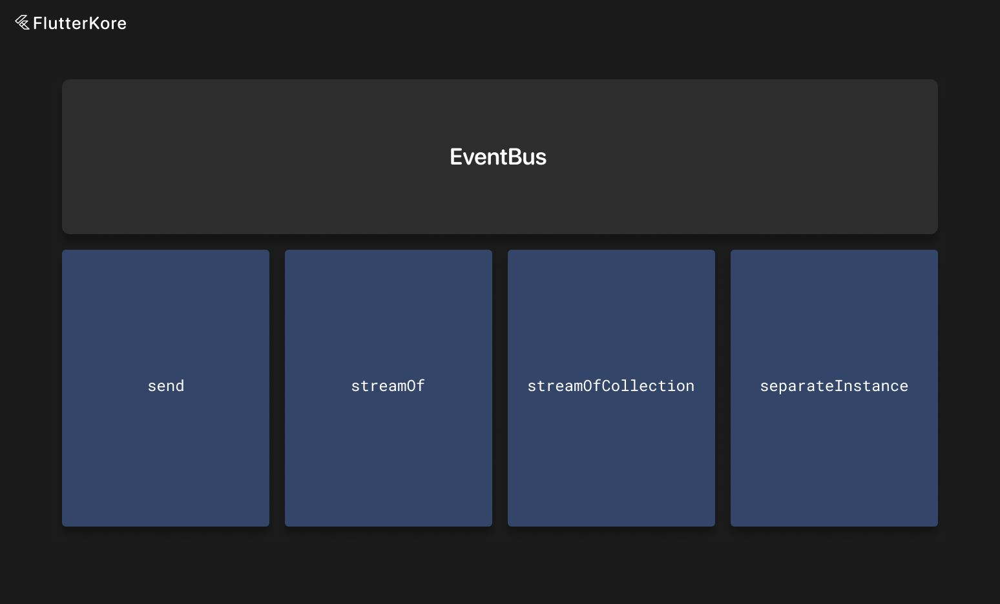

# EventBus



The EventBus instance is available globally with `app.eventBus` or via the `EventBus` singleton.

Every kore instance has access to `EventBus` events. Events can be subscribed to with the `subscribe` method.

Events are just model classes with needed fields.

An example:

```dart
class PostLikedEvent {
  final int id;

  const PostLikedEvent({required this.id});
}
```

```dart
@override
List<EventBusSubscriber> subscribe() => [
      on<PostLikedEvent>((event) {
        _onPostLiked(event.id);
      }),
    ];
```

```dart
app.eventBus.send(PostLikedEvent(id: id));
```

You can also create a separate instance of `EventBus` to handle specific operations—for example, file uploading. While we upload a file, we may want to send progress events in a separate event bus.

```dart
final fileUploadEventBus = EventBus.newSeparateInstance();
```

Be aware that instances are not connected to this new separate event bus, and you need to write the subscription logic yourself (do not forget to dispose of event subscriptions).

Reactions to events for every kore instance can be paused and resumed with corresponding methods. By default, events do not react to pauses. To enable this, you can subscribe to events as follows:

```dart
@override
List<EventBusSubscriber> subscribe() => [
      on<PostLikedEvent>(
        (event) {
          _onPostLiked(event.id);
        },
        reactsToPause: true,
        // flag indicating if instance needs to 'replay' events that were received while instance was paused
        firesAfterResume: false,
      ),
    ];
```

By default, view models pause event subscriptions when the view becomes invisible and pause them for all dependencies.

If you want to manually pause events for an instance, you can call `pauseEventBusSubscription`.

When you want to resume events for an instance, call `resumeEventBusSubscription`.

You can also manually subscribe to a particular event or a list of events anywhere in the app.

Here is an example:

```dart
final completer = Completer();

final subscription = app.eventBus.streamOf<TestEvent>().listen((event) {
    if (event.number == 2) {
        completer.complete();
    }
});

final subscriptionForList = app.eventBus.streamOfCollection([
    UserDownloadedEvent,
    UserLoggedOutEvent,
]).listen((event) {
    if (event is UserDownloadedEvent) {
        completer.complete();
    }

    if (event is UserLoggedOutEvent) {
        completer.complete();
    }
});

subscription.cancel();
subscriptionForList.cancel();
```

Do not forget to cancel manually created event subscriptions.