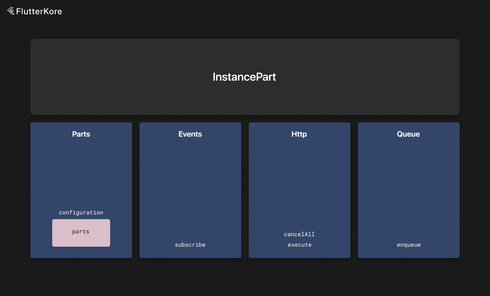

# Parts



A Part is an kore instance type that has a reference to a parent kore instance. It is useful for splitting logic in large instances.

Parts extend `RestrictedInstancePart` or `UniversalInstancePart`.

`UniversalInstancePart` is a generic type that can be connected to any kore instance.

`RestrictedInstancePart` allows you to specify the type of instance that it can be connected to via a generic argument.

You also need to specify the input type for parts. It is passed as a generic argument. Then the input is available in all initialization methods.

You must annotate parts with the `instancePart` annotation.

A part can receive events and can't have state or dependencies.

A part can contain other parts.

If a part is connected to another part, then you can get the root parent instance reference with the `rootParentInstance` field.

Here is an example:

```dart
@instancePart
class TestInteractorPart extends RestrictedInstancePart<Map<String, dynamic>, PostsInteractor> {
  @override
  KoreInstanceConfiguration get configuration =>
    KoreInstanceConfiguration(
      parts: [
        app.connectors.downloadUserPartConnector(input: input['id']),
        app.connectors.followUserPartConnector(input: input['id']),
      ],
    );

  late final downloadUser = useInstancePart<DownloadUserPart>();

  void testUpdate() {
    parentInstance.updateState(parentInstance.state.copyWith(
      active: false,
    ));

    rootParentInstance.updateState(rootParentInstance.state.copyWith(
      active: false,
    ));
  }

  @override
  Future<void> initializeAsync() async {
    // ...
  }

  @override
  Future<void> dispose() async {
    // ...
  }

  @override
  void onAsyncPartReady(Type type, {int? index}) {
    switch (type) {
      case value:
        
        break;
      default:
    }
  }

  @override
  List<EventBusSubscriber> subscribe() => [
      on<PostLikedEvent>((event) {
        _onPostLiked(event.id);
      }),
    ];
}
```

And a universal part:

```dart
@instancePart
class TestUniversalInteractorPart extends UniversalInstancePart<Map<String, dynamic>> {
  void testUpdate() {
    // some update code
  }
}

@basicInstance
class PostsInteractor extends BaseInteractor<PostsState, Map<String, dynamic>>
    with LikePostMixin {
  @override
  DependentKoreInstanceConfiguration get configuration =>
    DependentKoreInstanceConfiguration(
      parts: [
        app.connectors.testUniversalInteractorPartConnector(),
        app.connectors.testInteractorPartConnector(input: input['id']),
      ],
    );

  late final testPart = useInstancePart<TestInteractorPart>();
  late final testUniversalPart = useInstancePart<TestUniversalInteractorPart>();
}
```

There is also the ability to execute code in a synchronized queue—meaning that if there are currently running operations, new code will be executed after all previous operations complete; otherwise, the operation will be executed instantly.

By default, if a part is disposed, all pending operations are discarded, but this can be changed with the `discardOnDispose` flag. Also, you can provide an optional timeout for this operation.

```dart
@instancePart
class TestInteractorPart extends RestrictedInstancePart<Map<String, dynamic>, PostsInteractor> {
  Future<void> loadPosts(int offset, int limit, {bool refresh = false}) async {
    enqueue(operation: () async {
      parentInstance.updateState(parentInstance.state.copyWith(posts: LoadingData()));

      late Response<List<Post>> response;

      if (refresh) {
        response = await app.apis.posts.getPosts(0, limit).execute();
      } else {
        response = await app.apis.posts.getPosts(offset, limit).execute();
      }

      if (response.isSuccessful || response.isSuccessfulFromDatabase) {
        parentInstance.updateState(parentInstance.state.copyWith(posts: SuccessData(response.result ?? [])));
      } else {
        parentInstance.updateState(parentInstance.state.copyWith(posts: ErrorData(response.error)));
      }
    })
  }
}
```