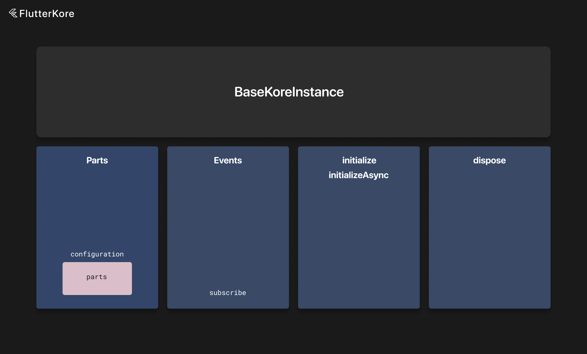

# kore Instance



kore instance is the base class for every flutter_kore component.

It contains a simple interface with initialize and dispose methods.

Every kore instance is connected to the global event bus, so in every kore instance you can subscribe to events. More information about the event bus can be found [here](./event_bus.md).

And every kore instance can contain parts. More information about instance parts can be found [here](./instance_part.md).

So you can add them via the `parts` field in the configuration object and then call the `useInstancePart<T>()` method.

The configuration object is provided via the `configuration` getter for every kore instance.

Interactors, wrappers, instance parts, view models and indepenent views — all of them mix `KoreInstance`.

If you extended `BaseKoreInstance`, you can mark child classes with DI annotations and use them with the `app.instances` interface. More information about DI can be found [here](./di.md).

Here is an example of a simple custom kore instance that you can create:

```dart
abstract class BaseBox extends BaseKoreInstance<dynamic> {
  String get boxName;

  late final hiveWrapper = app.instances.get<HiveWrapper>();

  @mustCallSuper
  @override
  void initialize(dynamic input) {
    super.initialize(input);
  }

  @mustCallSuper
  @override
  void dispose() {
    super.dispose();
  }
}
```

Then you can use it in child classes and receive events, connect parts, etc.

```dart
@basicInstance
class UsersBox extends BaseBox {
  @override
  KoreInstanceConfiguration get configuration =>
    KoreInstanceConfiguration(
      parts: [
        const PartConnector(type: TestInstancePart1, input: 5, isAsync: true),
        const PartConnector(
            type: TestInstancePart2,
            isAsync: true,
            count: 2,
            input: 10,
        ),
        PartConnector(
            type: TestInstancePart3,
            count: 2,
            inputForIndex: (index) => index + 1,
        ),
        PartConnector(
            type: TestInstancePart4,
            isAsync: true,
            count: 2,
            inputForIndex: (index) => index + 1,
        ),
        const PartConnector(
            type: TestInstancePart5,
            withoutConnections: true,
        ),
      ],
    );

  late final testInstancePart1 = useInstancePart<TestInstancePart1>();

  @override
  List<EventBusSubscriber> subscribe() => [
      on<PostLikedEvent>((event) {
        _onPostLiked(event.id);
      }),
    ];
}
```

Every kore instance can also be async. In this case, you need to specify the `isAsync` flag in the configuration object. And also you can override the `initializeAsync` method.

Here is an example:

```dart
@basicInstance
class UsersBox extends BaseBox {
  @override
  KoreInstanceConfiguration get configuration =>
    KoreInstanceConfiguration(
      parts: [
        const PartConnector(type: TestInstancePart1, input: 5, isAsync: true),
      ],
      isAsync: true,
    );

  late final testInstancePart1 = useInstancePart<TestInstancePart1>();

  @override
  Future<void> initializeAsync() async {
    // ...
    
    // call this method at the end of async initialization
    await super.initializeAsync();
  }

  @override
  List<EventBusSubscriber> subscribe() => [
      on<PostLikedEvent>((event) {
        _onPostLiked(event.id);
      }),
    ];
}
```