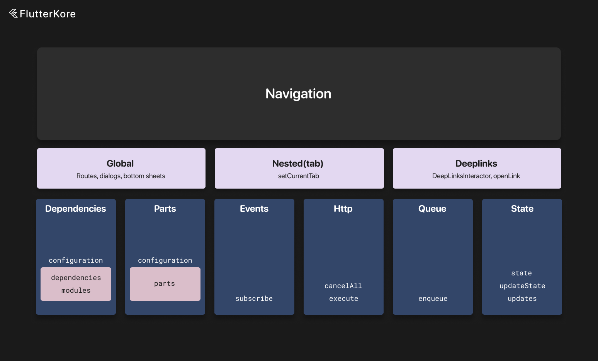
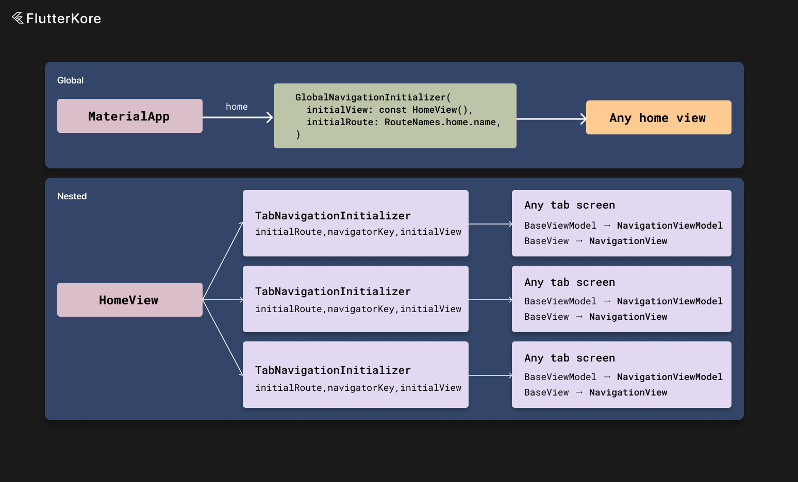
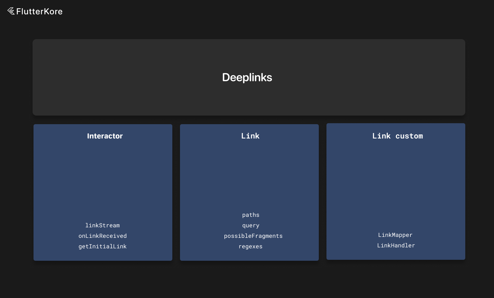
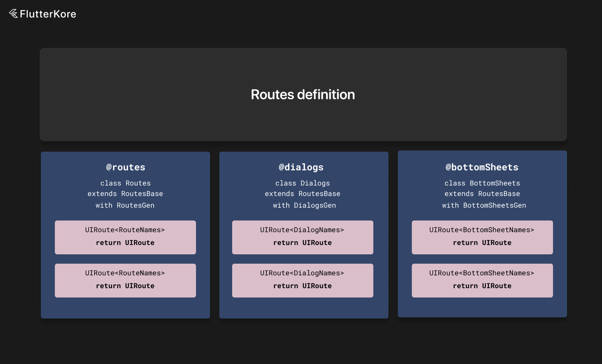

# Navigation



The package also contains a default way to handle navigation.

To use this feature, you need to subclass `NavigationInteractorDeclaration` and mark the class with the `AppNavigation` annotation. The navigation interactor must be marked as `singleton`. `NavigationInteractorDeclaration` will be generated.

Then it will be available via `app.navigation`.

Supports nested tab navigation, separate navigator for dialogs and bottom sheets, and PopScope.

If your app contains tab (nested) navigation, then NavigationInteractor will look like this:

```dart
@singleton
@AppNavigation(tabs: AppTab)
class NavigationInteractor extends NavigationInteractorDeclaration<NavigationState> {
  @override
  AppTab? get currentTab => state.currentTab;

  // you can set this field any time
  // In general, you need to set current tab keys in tab home view 
  // and keep global keys in tab home view model
  // so it can be changed every time tab home screen is reopened
  @override
  Map<AppTab, GlobalKey<NavigatorState>> currentTabKeys = {
        AppTabs.posts: GlobalKey<NavigatorState>(),
        AppTabs.likedPosts: GlobalKey<NavigatorState>(),
      };

  @override
  NavigationInteractorSettings get settings => NavigationInteractorSettings(
        initialRoute: RouteNames.home,
        tabs: AppTabs.tabs,
        tabViewHomeRoute: RouteNames.home,
        initialTabRoutes: {
          AppTabs.posts: RouteNames.posts,
          AppTabs.likedPosts: RouteNames.likedPosts,
        },
        appContainsTabNavigation: true,
      );

  @override
  Future<void> onBottomSheetOpened(Widget child, UIRouteSettings route) async {
    // ignore
  }

  @override
  Future<void> onDialogOpened(Widget child, UIRouteSettings route) async {
    // ignore
  }

  @override
  Future<void> onRouteOpened(Widget child, UIRouteSettings route) async {
    if (route.global) {
      app.eventBus.send(GlobalRoutePushedEvent(replace: route.replace));
    }
  }

  @override
  void setCurrentTab(AppTab tab) {
    updateState(state.copyWith(currentTab: tab));
  }

  @override
  NavigationState get initialState => NavigationState(
        currentTab: AppTabs.posts,
      );
}
```

`AppTab` here can be any immutable model class—it will be used as a key to a map of `GlobalKey` objects for tab navigation. For example, it can be a model class with an icon name and id.

You also need to override navigation interactor settings to set default values for required fields. You can see all needed values in the example above.

Also, you need to override the `setCurrentTab` method to keep the current tab value in the state. The state can be any immutable object like in any other interactor.

If the app does not contain tab (nested) navigation, then you can skip tab-related methods:

```dart
@singleton
@AppNavigation()
class NavigationInteractor extends NavigationInteractorDeclaration<NavigationState> {
  @override
  NavigationInteractorSettings get settings => NavigationInteractorSettings(
        initialRoute: RouteNames.home,
        bottomSheetsAndDialogsUsingGlobalNavigator: false,
      );

  @override
  Future<void> onBottomSheetOpened(Widget child, UIRouteSettings route) async {
    unawaited(analyticsWrapper.logScreenView(
      child.runtimeType.toString(),
      route.name ?? '',
    ));
  }

  @override
  Future<void> onDialogOpened(Widget child, UIRouteSettings route) async {
    unawaited(analyticsWrapper.logScreenView(
      child.runtimeType.toString(),
      route.name ?? '',
    ));
  }

  @override
  Future<void> onRouteOpened(Widget child, UIRouteSettings route) async {
    unawaited(analyticsWrapper.logScreenView(
      child.runtimeType.toString(),
      route.name ?? '',
    ));

    if (route.global) {
      app.eventBus.send(GlobalRoutePushedEvent(replace: route.replace));
    }
  }

  @override
  List<EventBusSubscriber> subscribe() => [
      ];

  @override
  NavigationState get initialState => NavigationState();
}
```

The last flag that describes the navigation flow in the app is `bottomSheetsAndDialogsUsingGlobalNavigator`.

If this flag is false (like in the last code snippet), then you need to create a separate navigator for bottom sheets and dialogs—useful if you have some overlay views for the app. In this case, the global route will be opened in the global navigator, and bottom sheets and dialogs will be opened in a separate navigator that you can place anywhere you want.

You also need to specify the navigation interactor in the main app annotation.

```dart
@MainApp(navigationInteractorType: NavigationInteractor)
class App extends KoreApp<NavigationInteractor> with AppGen {
}
```

You also need to initialize default values:

```dart
UINavigationSettings.transitionDuration = kAnimationDuration;
UINavigationSettings.barrierColor = UIColors.surfaceDarkSemitransparent;
UINavigationSettings.bottomSheetBorderRadius = BorderRadius.only(
  topLeft: UIDimentions.defaultWidgetBorderRadius.topLeft,
  topRight: UIDimentions.defaultWidgetBorderRadius.topRight,
);
```

If you need to specify a custom transition builder, you can specify `routeBuilder` in the navigation settings object or you can specify `customRouteBuilder` for a specific route.

You can see how routes are specified in the `example_navigation` example and in the section below.

You also need to create a root navigation view model and view state. This is described below.

And here is also a list of methods in `BaseNavigationInteractor`. Parameters for routes will be discussed below:

```dart
bool isInGlobalStack({bool includeBottomSheetsAndDialogs = true});

void pop({
  dynamic payload,
  bool onlyInternalStack = false,
});

void popInTab(
  AppTabType tab, {
  dynamic payload,
  bool onlyInternalStack = false,
});

Future<void> routeTo(
  UIRoute<RouteType> routeData, {
  bool? fullScreenDialog,
  bool replace = false,
  bool replacePrevious = false,
  bool? uniqueInStack,
  bool? forceGlobal,
  bool? needToEnsureClose,
  bool? dismissable,
  Object? id,
  NavigationRouteBuilder? customRouteBuilder,
  bool awaitRouteResult = false,
});

Future<dynamic> showDialog(
  UIRoute<DialogType> dialog, {
  bool? forceGlobal,
  bool? dismissable,
  bool? uniqueInStack,
  Object? id,
  NavigationRouteBuilder? customRouteBuilder,
});

Future<dynamic> showBottomSheet(
  UIRoute<BottomSheetType> bottomSheet, {
  bool? forceGlobal,
  bool? dismissable,
  bool? uniqueInStack,
  Object? id,
  NavigationRouteBuilder? customRouteBuilder,
});

Future<bool> openLink(
  String link, {
  bool preferDialogs = false,
  bool preferBottomSheets = false,
  bool? fullScreenDialog,
  bool? replace,
  bool? replacePrevious,
  bool? uniqueInStack,
  bool? forceGlobal,
  bool? needToEnsureClose,
  bool? dismissable,
  Object? id,
  NavigationRouteBuilder? customRouteBuilder,
});

void setCurrentTab(AppTabType tab);
bool canPop({bool global = true});
void popGlobalToFirst();
void popInTabToFirst(AppTabType appTab, {bool clearStack = true});
void popToTab(AppTabType tab);
void popAllNavigatiorsToFirst();
void popAllDialogsAndBottomSheets();
void popUntil(Object routeName, {bool forceGlobal = false});
void popGlobalUntil(Object routeName);
void popInTabUntil(Object routeName);
void popAllTabsToFirst();
bool containsGlobalRoute(Object routeName);
UIRouteModel latestGlobalRoute();
UIRouteModel latestTabRoute();
```

All these methods are available via `app.navigation`. And you can add your own methods if you want or override existing ones—for example, if you want to send an analytics event every time some route is opened.

To complete navigation initialization, you also need to provide root views for global and tab navigation (if present).



For global navigation, there is `GlobalNavigationInitializer`. Place it inside your `MaterialApp` and do not pass the global navigator key to the `MaterialApp` constructor. If you use a separate key for bottom sheets and dialogs, you can pass it to `MaterialApp`.

For tab navigation, there is `TabNavigationInitializer`. Use it as your root tab widget. An example is below.

If you use tab navigation, you need to use `IndependentNavigationView` or `NavigationViewModel` and `NavigationView` as base classes for your views and view models since it ensures that navigation is handled in the correct navigation scope (tab or global).

Here are some examples:

```dart
class _AppViewWidgetState
    extends NavigationView<AppView, AppViewState, AppViewModel> {
  @override
  Widget buildView(BuildContext context) {
    return MaterialApp(
      debugShowCheckedModeBanner: false,
      home: GlobalNavigationInitializer(
        initialView: const HomeView(),
        initialRoute: RouteNames.home.name,
      ),
    );
  }

  @override
  AppViewModel createViewModel() {
    return AppViewModel();
  }
}
```

If your app uses a separate navigator key for dialogs and bottom sheets, you need to replace the global navigator with `GlobalNavigationPopScope`. Here is an example:

```dart
class AppViewModel extends NavigationViewModel<AppView, AppViewState> {
  @override
  void onLaunch() {
    super.onLaunch();
  }

  void fireLifecycleEvent(AppLifecycleState state) {
    app.eventBus.send(AppLifecycleStateChangedEvent(state: state));
  }

  @override
  AppViewState get initialState => const AppViewState();
}

class AppViewWidgetState extends NavigationView<AppView, AppViewState, AppViewModel> {
  @override
  Widget buildView(BuildContext context) {
    return MaterialApp(
        debugShowCheckedModeBanner: false,
        navigatorKey: app.navigation.bottomSheetDialogNavigatorKey,
        home: GlobalNavigationInitializer(
          initialView: const HomeView(),
          initialRoute: RouteNames.home.name,
        ),
    );
  }
}
```

And here are examples for tab navigation initialization:

```dart
class HomeViewModel extends NavigationViewModel<HomeView, HomeViewState> {
  final Map<AppTab, GlobalKey<NavigatorState>> tabNavigatorKeys = {
    AppTabs.posts: GlobalKey<NavigatorState>(),
    AppTabs.likedPosts: GlobalKey<NavigatorState>(),
    AppTabs.user: GlobalKey<NavigatorState>(),
  };

  @override
  DependentKoreInstanceConfiguration get configuration =>
    DependentKoreInstanceConfiguration(
      dependencies: [
        app.connectors.postsInteractorConnector(),
      ],
    );

  late final postsInteractor = useLocalInstance<PostsInteractor>();
  late final authorizationInteractor = app.instances.get<AuthorizationInteractor>();
  late final currentUserInteractor = app.instances.get<CurrentUserInteractor>();

  @override
  void onLaunch() {
    app.navigation.currentTabKeys = tabNavigatorKeys;

    // calling it here to ensure navigation initialized
    app.navigation.deepLinks.receiveInitialLink().then((value) {
      app.navigation.deepLinks.listenToDeeplinks();
    });
  }
}

class HomeView extends BaseWidget {
  const HomeView({
    super.key,
    super.viewModel,
  });

  @override
  State<StatefulWidget> createState() {
    return _HomeViewWidgetState();
  }
}

class _HomeViewWidgetState extends NavigationView<HomeView, HomeViewState, HomeViewModel> {
  late final Map<AppTab, Widget> tabViews = {
    AppTabs.posts: Container(),
    AppTabs.likedPosts: Container(),
    AppTabs.user: Container(),
  };

  @override
  Widget buildView(BuildContext context) {
    return Scaffold(
      backgroundColor: Colors.white,
      body: KoreStreamBuilder<AppTab?>(
        streamWrap: viewModel.currentTab,
        builder: (context, snapshot) {
          return Stack(
            children: AppTabs.tabs
                .map((tab) => tabNavigationContainer(
                      offstage: snapshot.data?.index != tab.index,
                      navigationKey: viewModel.getNavigatorKey(tab),
                      view: tabViews[tab]!,
                      name: tab.name,
                    ))
                .toList(),
          );
        },
      ),
      bottomNavigationBar: KoreStreamBuilder<AppTab?>(
        streamWrap: viewModel.currentTab,
        builder: (context, snapshot) {
          if (snapshot.data == null) {
            return const SizedBox.shrink();
          }

          return BottomNavigation(
            currentTab: snapshot.data!,
            onTabChanged: viewModel.changeTab,
            items: tabViews.keys.map((tab) {
              return BottomNavigationItemData(tab);
            }).toList(),
          );
        },
      ),
    );
  }

  Widget tabNavigationContainer({
    required bool offstage,
    required GlobalKey<NavigatorState> navigationKey,
    required Widget view,
    required String name,
  }) {
    return Offstage(
      offstage: offstage,
      child: HeroControllerScope(
        controller: MaterialApp.createMaterialHeroController(),
        child: TabNavigationInitializer(
          initialRoute: name,
          navigatorKey: navigationKey,
          initialView: view,
        ),
      ),
    );
  }
}
```

And if you are using tab navigation, every other view state other than global and tab root view states should extend  `IndependentNavigationView` or `NavigationViewModel` and `NavigationView`:

```dart
class PostsView extends StatefulWidget {
  const PostsView({
    super.key,
  });

  @override
  State<StatefulWidget> createState() {
    return _PostsViewWidgetState();
  }
}

class _PostsViewWidgetState extends IndependentNavigationView<HomeView> {
  @override
  Widget buildView(BuildContext context) {
    return Scaffold(
      backgroundColor: UIColors.surfaceDark,
      body: Container(),
    );
  }
}

// or

class PostsViewModel extends NavigationViewModel<HomeView, HomeViewState> {
  @override
  DependentKoreInstanceConfiguration get configuration =>
    DependentKoreInstanceConfiguration(
      dependencies: [
        app.connectors.postsInteractorConnector(),
      ],
    );

  late final postsInteractor = useLocalInstance<PostsInteractor>();

  @override
  void onLaunch() {
    // ignore
  }
}

class PostsView extends BaseWidget {
  const PostsView({
    super.key,
    super.viewModel,
  });

  @override
  State<StatefulWidget> createState() {
    return _PostsViewWidgetState();
  }
}

class _PostsViewWidgetState extends NavigationView<HomeView, HomeViewState, HomeViewModel> {
  @override
  Widget buildView(BuildContext context) {
    return Scaffold(
      backgroundColor: UIColors.surfaceDark,
      body: Container(),
    );
  }
}
```

Inside `NavigationViewModel`, you need to use the `pop` method of the view model instead of `app.navigation.pop()`.

### Deep Links



The navigation component supports deep links with `BaseDeepLinksInteractor`. The deep links interactor must be marked as `singleton`.

You need to specify it in the `AppNavigation` annotation `deepLinks` arguments.

You need to provide methods to get the initial link and get a stream of deep links.

You can also override `onLinkReceived` to process some links that do not require route processing. Do not forget to call `super.onLinkReceived(link)`.

To respond to deep links, define routes with the `@Link` annotation. An example for this will be in the next section.

Here is an example of a deep links interactor:

```dart
@singleton
class TestDeepLinksInteractor extends BaseDeepLinksInteractor<int> {
  bool defaultLinkHandlerCalled = false;

  final linkStreamController = StreamController<String>.broadcast();

  @override
  Future<void> defaultLinkHandler(String? link) async {
    defaultLinkHandlerCalled = true;
  }

  @override
  Future<String?> getInitialLink() async {
    return 'test';
  }

  @override
  int get initialState => 1;

  @override
  Future<void> onLinkReceived(String? link) async {
    if (link == null) {
      return;
    }

    if (link.contains('test')) {
      // do something
    } else {
      await super.onLinkReceived(link);
    }
  }

  @override
  Stream<String> linkStream() {
    return linkStreamController.stream;
  }

  @override
  void dispose() {
    super.dispose();

    linkStreamController.close();
  }
}
```

You don't need to implement a deep links interactor to use the `openLink` method. It is only used for deep links.

## Defining Routes and Links



To define routes, you need to specify three classes—`Routes`, `Dialogs`, and `BottomSheets`.

Names must be exact.

In routes declaration, you need to define methods for your routes, dialogs, and bottom sheets and specify their parameters. You can also mark them with the `Link` annotation if you want the route to respond to `openLink` calls and deep links.

By defining a link, you can specify link filters for a specific screen.

Here is a list of supported filters:

1) `paths` - list of paths that this route supports. Paths are defined in the format 'posts/:{id}' where path params are changed with a pattern with parameter name. This parameter will then be available in `pathParams` with the corresponding key.
2) `query` - list of query filters for this route. Applies to all paths in the `paths` array. Query filters support the following options:
    * basic filter - query: [ 'param' ] - this means that the param is required in the query. If this param is not present in the query, the route won't be opened;
    * equality filter - query: [ 'param=qwerty1' ] - this means that the param is required in the query with the given value. If this param is not present in the query, the route won't be opened;
    * multiple equality filter - query: [ 'param=qwerty1|qwerty2' ] - this means that the param is required in the query with one of the given values. If this param is not present in the query, the route won't be opened;
3) `queriesForPath` - same as `query` but for every corresponding path in the `paths` array; 
4) `possibleFragments` - list of fragment restrictions for this link. If the link does not contain a fragment value equal to one of the values in the list, the route won't be opened. Applies to all paths in the `paths` array;
5) `possibleFragmentsForPath` - same as `possibleFragments` but for every corresponding path in the `paths` array;
6) `regexes` - list of regular expressions that this route supports. If the link does not match one of the given regexes, the route won't be opened. If you specify this parameter, you also need to pass `customParamsMapper`. An example of this can be found below;
7) `customHandler` - you can pass a custom handler for the route and parse the URL how you want. You can return null from `parseLinkToRoute` if you want to skip this link.

Here are examples of possible links:

```dart
class TestMapper extends LinkMapper {
  @override
  UIRoute constructRoute(LinkParams params) {
    return UIRoute<RouteNames>(
      name: RouteNames.postsRegex,
      defaultSettings: const UIRouteSettings(),
      child: Container(),
    );
  }

  @override
  LinkParams mapParamsFromUrl(
    String url,
  ) {
    return const LinkParams(
      pathParams: {
        'testParam': 'test',
      },
      queryParams: {},
      state: null,
    );
  }

  @override
  Future<void> openRoute(UIRoute route) async {
    await app.navigation.routeTo(route as UIRoute<RouteNames>);
  }
}

class TestHandler extends LinkHandler {
  @override
  Future<UIRoute?> parseLinkToRoute(String url) async {
    return UIRoute(
      name: 'test',
      defaultSettings: const UIRouteSettings(),
      child: Container(),
    );
  }

  @override
  Future<void> processRoute(UIRoute route) async {}
}

@routes
class Routes extends RoutesBase with RoutesGen {
  @Link(
    paths: ['posts/:{id}'],
    query: [
      'filter',
    ],
  )
  UIRoute<RouteNames> postWithFilter({
    Post? post,
    int? id,
    int? filter,
    Map<String, dynamic>? pathParams,
    Map<String, dynamic>? queryParams,
  }) {
    return UIRoute(
      name: RouteNames.postWithFilter,
      defaultSettings: const UIRouteSettings(),
      child: Container(),
    );
  }

  @Link(
    paths: [
      'posts/:{id}/:{type}',
      'posts/:{id}/test/test',
    ],
    query: [
      'filter=qwerty1|qwerty2',
    ],
    customHandler: TestHandler,
  )
  UIRoute<RouteNames> postWithType({
    Post? post,
    int? id,
    int? filter,
    Map<String, dynamic>? pathParams,
    Map<String, dynamic>? queryParams,
  }) {
    return UIRoute(
      name: RouteNames.postWithType,
      defaultSettings: const UIRouteSettings(),
      child: Container(),
    );
  }

  @Link(
    paths: [
      'posts/:{id}',
    ],
    query: [
      'filter=qwerty1|qwerty2',
    ],
  )
  UIRoute<RouteNames> postFilterMultiplePossibleValues({
    int? post,
    int? id,
    int? filter,
    Map<String, dynamic>? pathParams,
    Map<String, dynamic>? queryParams,
  }) {
    return UIRoute(
      name: RouteNames.postFilterMultiplePossibleValues,
      defaultSettings: UIRouteSettings(
        global: pathParams != null,
      ),
      child: Container(),
    );
  }

  @Link(
    paths: [
      'posts/:{id}',
    ],
    query: [
      'filter=qwerty1|qwerty2',
    ],
    possibleFragments: [
      'state',
    ],
  )
  UIRoute<RouteNames> postFilterMultiplePossibleValuesWithAnchor({
    int? post,
    int? id,
    int? filter,
    Map<String, dynamic>? pathParams,
    Map<String, dynamic>? queryParams,
  }) {
    return UIRoute(
      name: RouteNames.postFilterMultiplePossibleValuesWithAnchor,
      defaultSettings: UIRouteSettings(
        global: pathParams != null,
      ),
      child: Container(),
    );
  }

  @Link(
    paths: ['posts/:{id}'],
    query: [
      'filter=[qwerty1,qwerty2]',
    ],
  )
  UIRoute<RouteNames> postArray({
    Post? post,
    int? id,
    int? filter,
    Map<String, dynamic>? pathParams,
    Map<String, dynamic>? queryParams,
  }) {
    return UIRoute(
      name: RouteNames.postArray,
      defaultSettings: const UIRouteSettings(),
      child: Container(),
    );
  }

  @Link(
    paths: ['posts/:{id}'],
    query: [
      'filter=qwerty',
    ],
  )
  UIRoute<RouteNames> postExactFilter({
    Post? post,
    int? id,
    int? filter,
    Map<String, dynamic>? pathParams,
    Map<String, dynamic>? queryParams,
  }) {
    return UIRoute(
      name: RouteNames.postExactFilter,
      defaultSettings: const UIRouteSettings(),
      child: Container(),
    );
  }

  @Link(
    paths: ['posts/:{id}'],
    query: ['filter', 'query?'],
  )
  UIRoute<RouteNames> postFilterAndQuery({
    Post? post,
    int? id,
    int? filter,
    Map<String, dynamic>? pathParams,
    Map<String, dynamic>? queryParams,
  }) {
    return UIRoute(
      name: RouteNames.postFilterAndQuery,
      defaultSettings: const UIRouteSettings(),
      child: Container(),
    );
  }

  @Link(
    paths: ['posts/:{id}/test'],
    query: ['filter', 'query?'],
  )
  UIRoute<RouteNames> postFilterAndQueryDifferentRoute({
    Post? post,
    int? id,
    int? filter,
    Map<String, dynamic>? pathParams,
    Map<String, dynamic>? queryParams,
  }) {
    return UIRoute(
      name: RouteNames.postFilterAndQueryDifferentRoute,
      defaultSettings: const UIRouteSettings(),
      child: Container(),
    );
  }

  @Link(
    paths: ['posts'],
  )
  UIRoute<RouteNames> posts({
    Map<String, dynamic>? pathParams,
    Map<String, dynamic>? queryParams,
  }) {
    return UIRoute(
      name: RouteNames.posts,
      defaultSettings: const UIRouteSettings(),
      child: Container(),
    );
  }

  @Link(paths: ['posts'], query: [
    'filter',
  ])
  UIRoute<RouteNames> postsWithFilter({
    Map<String, dynamic>? pathParams,
    Map<String, dynamic>? queryParams,
  }) {
    return UIRoute(
      name: RouteNames.postsWithFilter,
      defaultSettings: const UIRouteSettings(),
      child: Container(),
    );
  }

  @Link(paths: ['stub'], query: [
    'filter',
  ])
  UIRoute<RouteNames> stub({
    Map<String, dynamic>? pathParams,
    Map<String, dynamic>? queryParams,
  }) {
    return UIRoute(
      name: RouteNames.stub,
      defaultSettings: const UIRouteSettings(),
      child: Container(),
    );
  }

  UIRoute<RouteNames> home() {
    return UIRoute(
      name: RouteNames.home,
      defaultSettings: const UIRouteSettings(),
      child: Container(),
    );
  }

  UIRoute<RouteNames> likedPosts() {
    return UIRoute(
      name: RouteNames.likedPosts,
      defaultSettings: const UIRouteSettings(),
      child: Container(),
    );
  }

  @Link(
    regexes: ['(.*?)'],
    customParamsMapper: TestMapper,
  )
  UIRoute<RouteNames> postsRegex({
    Map<String, dynamic>? pathParams,
    Map<String, dynamic>? queryParams,
  }) {
    return UIRoute(
      name: RouteNames.postsRegex,
      defaultSettings: const UIRouteSettings(),
      child: Container(),
    );
  }

  @Link(
    paths: ['*/posts/:{id}'],
  )
  UIRoute<RouteNames> postsWithPrefix({
    Map<String, dynamic>? pathParams,
    Map<String, dynamic>? queryParams,
  }) {
    return UIRoute(
      name: RouteNames.postsWithPrefix,
      defaultSettings: const UIRouteSettings(),
      child: Container(),
    );
  }

  @Link(
    paths: ['*/posts/test/:{id}'],
  )
  UIRoute<RouteNames> postsWithAnchor({
    String? state,
    Map<String, dynamic>? pathParams,
    Map<String, dynamic>? queryParams,
  }) {
    return UIRoute(
      name: RouteNames.postsWithAnchor,
      defaultSettings: const UIRouteSettings(),
      child: Container(),
    );
  }

  @Link(
    paths: [
      'posts/:{id}',
    ],
    query: [
      'filter=qwerty1|qwerty2',
    ],
    possibleFragments: [
      'state',
    ],
  )
  UIRoute<RouteNames> postFilterMultiplePossibleValuesWithAnchor({
    int? post,
    int? id,
    int? filter,
    Map<String, dynamic>? pathParams,
    Map<String, dynamic>? queryParams,
  }) {
    return UIRoute(
      name: RouteNames.postFilterMultiplePossibleValuesWithAnchor,
      defaultSettings: UIRouteSettings(
        global: pathParams != null,
      ),
      child: Container(),
    );
  }

  @Link(
    paths: [
      '*/posts/test/:{id}',
      '*/posts/test2/:{id}',
    ],
    queriesForPath: [
      ['filter'],
      ['specialFilter'],
    ],
  )
  UIRoute<RouteNames> postsWithQueriesForPath({
    Map<String, dynamic>? pathParams,
    Map<String, dynamic>? queryParams,
  }) {
    return UIRoute(
      name: RouteNames.postsWithQueriesForPath,
      defaultSettings: UIRouteSettings(
        global: pathParams != null,
      ),
      child: Container(),
    );
  }

  @Link(
    paths: [
      '*/posts/test/:{id}',
      '*/posts/test2/:{id}',
    ],
    possibleFragmentsForPath: [
      ['statevar'],
      ['stateanothervar'],
    ],
  )
  UIRoute<RouteNames> postsWithFragmentsForPath({
    Map<String, dynamic>? pathParams,
    Map<String, dynamic>? queryParams,
  }) {
    return UIRoute(
      name: RouteNames.postsWithFragmentsForPath,
      defaultSettings: UIRouteSettings(
        global: pathParams != null,
      ),
      child: Container(),
    );
  }
}
```

The same declaration goes for dialogs and bottom sheets. All link annotations are supported.

Here are small examples of differences with routes:

```dart
@bottomSheets
class BottomSheets extends RoutesBase with BottomSheetsGen {
  @Link(
    paths: ['authorizarion/:{id}'],
    query: [
      'filter',
    ],
  )
  UIRoute<BottomSheetNames> authorizarion({
    int? id,
    int? filter,
    Map<String, dynamic>? pathParams,
    Map<String, dynamic>? queryParams,
  }) {
    return UIRoute(
      name: BottomSheetNames.authorizarion,
      defaultSettings: const UIBottomSheetRouteSettings(),
      child: Container(),
    );
  }

  UIRoute<BottomSheetNames> postActions({
    Post? post,
    int? id,
  }) {
    return UIRoute(
      name: BottomSheetNames.postActions,
      defaultSettings: const UIBottomSheetRouteSettings(),
      child: Container(),
    );
  }
}
```

```dart
@dialogs
class Dialogs extends RoutesBase with DialogsGen {
  @Link(
    paths: ['error/:{id}'],
    query: [
      'filter',
    ],
  )
  UIRoute<DialogNames> error({
    int? id,
    int? filter,
    Map<String, dynamic>? pathParams,
    Map<String, dynamic>? queryParams,
  }) {
    return UIRoute(
      name: DialogNames.error,
      defaultSettings: const UIDialogRouteSettings(),
      child: Container(),
    );
  }

  UIRoute<DialogNames> info({
    Post? post,
  }) {
    return UIRoute(
      name: DialogNames.info,
      defaultSettings: const UIDialogRouteSettings(),
      child: Container(),
    );
  }
}
```

If you do not specify the `Link` annotation, the route won't respond to links.

You can also execute the link yourself with the `openLink` method of `NavigationInteractor`.

Parameters from the link will be available in `pathParams` and `queryParams`. You need to specify them in the function declaration.

If you need to access the URL fragment, add `String? state` to the function declaration.

Construction of the link is up to the developer.

If you are using this navigation in Flutter Web, you need to override the `openLink` method to set the URL address. You also need to provide `routeBuilder` in the settings for the navigation interactor.

### Calling Routes

After you define routes, you can call `build_runner` to generate routes. Routes will be available with `app.navigation.routes`, `app.navigation.dialogs` (for dialogs), and `app.navigation.bottomSheets` for bottom sheets. Here are examples:

```dart
app.navigation.routeTo(
  app.navigation.routes.posts()
);

app.navigation.showDialog(
  app.navigation.dialogs.error()
);

app.navigation.showBottomSheet(
  app.navigation.bottomSheets.authorization()
);

```

### Route Settings

You can pass settings to every route, dialog, or bottom sheet.

There are two ways to do it. First—you can pass `defaultSettings` when building routes. Second—you can pass it in `routeTo`, `showDialog`, `showBottomSheet`, or `openLink` methods. Default values will then be overwritten.

Here is a list of supported parameters:

1) dismissable - if true, then the route cannot be popped by system gestures or back buttons but can be popped with the `pop` method;
2) uniqueInStack - if true, then if a route with the given name is already present in the stack, the new route will be ignored;
3) needToEnsureClose - flag indicating that if system gestures or back buttons are used instead of popping the screen or ignoring it, the navigation interactor will send an `EnsureCloseRequestedEvent` event to the global event bus. You can subscribe to it in view models of screens that need to be checked before closing. It is recommended to pause this event so only the visible screen can respond to the sent event. More information about events can be found [here](./event_bus.md). Be aware that this flag does not work with the iOS swipe back gesture—it will always be executed if the route is `dismissable`;
4) fullScreenDialog - flag indicating that the route will be opened as a fullscreen dialog—with back gestures disabled on iOS and a specific animation;
5) global - flag indicating that this route must be opened in the global stack, not in the tab stack. If the app does not use tab navigation, this flag is ignored;
6) id - unique id of this route. Can be any Object;
7) replace - flag indicating that the route must replace all previous navigation history in the current navigation stack;
8) replacePrevious - flag indicating that the previous route in the current navigation stack should be popped;
9) name - name for this route.

Here is an example:

```dart
UIRoute<RouteNames> postsWithQueriesForPath({
  Map<String, dynamic>? pathParams,
  Map<String, dynamic>? queryParams,
}) {
  return UIRoute(
    name: RouteNames.postsWithQueriesForPath,
    defaultSettings: UIRouteSettings(
      global: pathParams != null,
    ),
    child: Container(),
  );
}

UIRoute<DialogNames> info({
  Post? post,
}) {
  return UIRoute(
    name: DialogNames.info,
    defaultSettings: const UIDialogRouteSettings(
      global: false,
    ),
    child: Container(),
  );
}

UIRoute<BottomSheetNames> postActions({
  Post? post,
  int? id,
}) {
  return UIRoute(
    name: BottomSheetNames.postActions,
    defaultSettings: const UIBottomSheetRouteSettings(
      global: false,
    ),
    child: Container(),
  );
}

app.navigation.routeTo(
  app.navigation.routes.posts(
    fullScreenDialog: true,
    replacePrevious: true,
    forceGlobal: true,
    id: 1,
  )
);

app.navigation.showDialog(
  app.navigation.dialogs.error(
    forceGlobal: true,
    id: 1,
  )
);

app.navigation.showBottomSheet(
  app.navigation.bottomSheets.authorization(
    forceGlobal: true,
    id: 1,
  )
);
```
