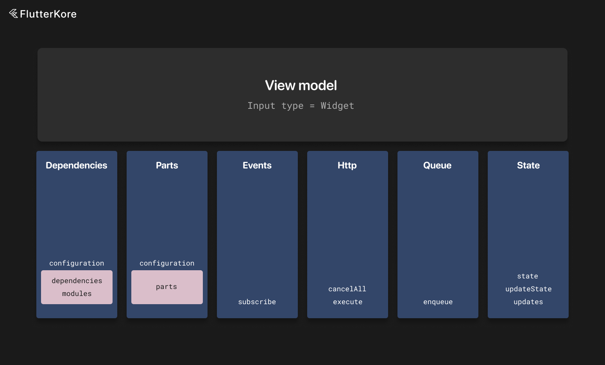

# ViewModel



View models contain logic for view classes.

View models can be ommited if they are not needed. Then you can use `IndependentBaseView`.

They also contain local state that we like `Interactor` can update with `updateState`.

We can also listen to state changes with the `updates` or `changes` methods.

There is also a `wrapUpdates` method that returns a `Stream` for a given mapper and also exposes the current value. This simplifies working with `StreamBuilder` — instead of creating a `Stream` getter with the `updates` method and a getter for the current value, you can use this method to get an object that wraps these getters. You can then use the `stream` field and the `current` getter. There is also a `wrapChanges` analogue for the `changes` method.

You also need to specify the input widget type for view models. It is passed as a generic argument.

Input is always available via the `input` field.

View models can also depend on [interactors](./interactor.md) and [wrappers](./wrapper.md) (or [custom](./custom_instance.md) instances) via the `dependencies` field in the configuration object.

View models can also contain [parts](./instance_part.md) via the `parts` field in the configuration object.

View models can also belong to modules via the `modules` field in the configuration object (information about modules can be found [here](./di.md)).

They are connected with `Connector` objects (more information about connectors can be found [here](./connectors.md) and for DI [here](./di.md)).

View models, like every kore instance, can receive `EventBus` events using the `subscribe` method.

More information about the event bus can be found [here](./event_bus.md).

To get local instances connected to the view model, use `useLocalInstance<T>()`.

To get a part, use the `useInstancePart<T>()` method.

View models can also override the `onLaunch` method, which is called on `initState`, and `onFirstFrame`, which is called on the first post-frame callback of the corresponding view.

```dart
class PostsListViewModel extends BaseViewModel<PostsListView, PostsListViewState> {
  @override
  DependentKoreInstanceConfiguration get configuration =>
    DependentKoreInstanceConfiguration(
      dependencies: [
        app.postsInteractorConnector(isLazy: true),
        app.postInteractorConnector(scopes: BaseScopes.unique),
        app.reactionsWrapperConnector(),
      ],
      parts: [
        app.connectors.downloadUserPartConnector(
          input: input.id,
          isAsync: true,
        ),
        app.connectors.followUserPartConnector(input: input.id),
      ],
    );

  late final postsInteractor = useLocalInstance<PostsInteractor>();
  late final reactionsWrapper = useLocalInstance<ReactionsWrapper>();

  late final downloadUser = useInstancePart<DownloadUserPart>();
  late final followUser = useInstancePart<FollowUserPart>();

  @override
  void onLaunch(PostsListView widget) {
    // Called with initState
    useLocalInstance<PostsInteractor>().loadPosts(0, 30);
  }

  @override
  void onFirstFrame(SearchView widget) {
    // Called with first frame - post frame callback
  }

  @override
  void onRestore(Map<String, dynamic> savedStateObject) {
    updateState(HomeViewState.fromJson(savedStateObject));
  }

  void like(int id) {
    postsInteractor.likePost(id);
  }

  void openPost(Post post) {
    app.navigation.routeTo(app.navigation.routes.post(id: '1'));
  }

  late final posts = postsInteractor.wrapUpdates((state) => state.posts);

  @override
  PostsListViewState get initialState => PostsListViewState();

  @override
  Map<String, dynamic> get savedStateObject => state.toJson();

  @override
  StateFulInstanceSettings get stateFulInstanceSettings =>
      StateFulInstanceSettings(
        stateId: state.runtimeType.toString(),
        isRestores: true,
        syncRestore: false,
      );

  @override
  List<EventBusSubscriber> subscribe() => [
      on<PostLikedEvent>((event) {
        _onPostLiked(event.id);
      }),
    ];
}
```

View models also have a `savedStateObject`, which can later be restored with `onRestore`.

By default, the state key for the saved object is equal to the state runtime type string, but you can override it with the `stateId` field in `stateFulInstanceSettings`. If the app uses obfuscation, this is **required**.

In the example above, we also specify the `syncRestore` option. If this option is set to `true`, the state will be restored from the cache during the `initialize` call. Otherwise, it will be restored asynchronously.

There is also the ability to execute code in a synced queue — meaning that if there are currently running operations, new code will be executed after all previous operations are completed. Otherwise, the operation will be executed instantly.

By default, if a view model is disposed, all pending operations are discarded, but this can be changed with the `discardOnDispose` flag. You can also provide an optional timeout for this operation.

```dart
class PostsListViewModel extends BaseViewModel<PostsListView, PostsListViewState> {
  Future<void> loadPosts(int offset, int limit, {bool refresh = false}) async {
    enqueue(operation: () async {
      updateState(state.copyWith(posts: LoadingData()));

      late Response<List<Post>> response;

      if (refresh) {
        response = await app.apis.posts.getPosts(0, limit).execute();
      } else {
        response = await app.apis.posts.getPosts(offset, limit).execute();
      }

      if (response.isSuccessful || response.isSuccessfulFromDatabase) {
        updateState(state.copyWith(posts: SuccessData(response.result ?? [])));
      } else {
        updateState(state.copyWith(posts: ErrorData(response.error)));
      }
    })
  }
}
```

To see base settings and methods of view models, you can visit [this page](./kore_instance.md).