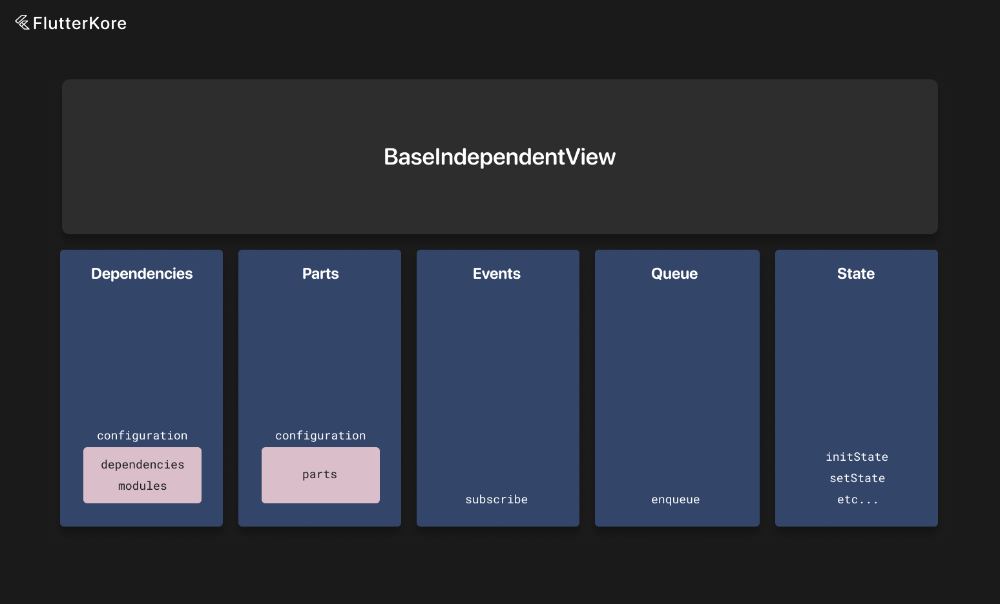
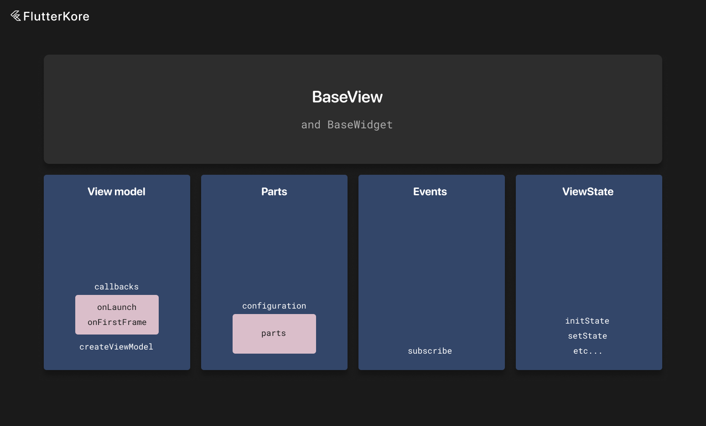

# Widget and View State

There are two types of views in FlutterKore - independent and view model dependent.

### Independent views



Independent views can also depend on [interactors](./interactor.md) and [wrappers](./wrapper.md) (or [custom](./custom_instance.md) instances) via the `dependencies` field in the configuration object.

Independent views can also contain [parts](./instance_part.md) via the `parts` field in the configuration object.

Independent views can also belong to modules via the `modules` field in the configuration object (information about modules can be found [here](./di.md)).

They are connected with `Connector` objects (more information about connectors can be found [here](./connectors.md) and for DI [here](./di.md)).

Independent views, like every kore instance, can receive `EventBus` events using the `subscribe` method.

More information about the event bus can be found [here](./event_bus.md).

To get local instances connected to the view model, use `useLocalInstance<T>()`.

To get a part, use the `useInstancePart<T>()` method.

Independent views can also override the `onFirstFrame`, which is called on the first post-frame callback of the corresponding view.

Example:

```dart
class TestView extends StatefulWidget {
  const TestView({
    super.key,
  });

  @override
  State<TestView> createState() {
    return TestViewWidgetState();
  }
}

class TestViewWidgetState extends BaseIndependentView<TestView> {
  int number = 1;

  @override
  DependentKoreInstanceConfiguration get configuration =>
      const DependentKoreInstanceConfiguration(
        dependencies: [
          Connector(type: TestInteractor1, input: 2),
          Connector(type: TestInteractorAsync4, input: 2, isAsync: true),
        ],
      );

  late final testInteractor1 = useLocalInstance<TestInteractor1>();
  late final testInteractor4 = useLocalInstance<TestInteractorAsync4>();

  void executeOperation() {
    enqueue(operation: () async {
      // some operation
    });
  }

  @override
  Widget buildView(BuildContext context) {
    return Container();
  }

  @override
  List<EventBusSubscriber> subscribe() => [
        on<TestEvent>((event) {
          number = event.number;
        }),
      ];
}
```

### Dependent views



View state has a reference to the view model and a method to create the view model.

If you need to pass a mocked view model, extend `BaseWidget` instead of `StatefulWidget`.

If a view model is passed to a `BaseWidget` child class, it will be provided to the view state and the default one won't be created.

Example:

```dart
class PostsListView extends BaseWidget {
  const PostsListView({
    super.key,
    super.viewModel,
  });

  @override
  State<StatefulWidget> createState() {
    return _PostsListViewWidgetState();
  }
}

class _PostsListViewWidgetState extends BaseView<PostsListView, PostsListViewState, PostsListViewModel> {
  @override
  Widget buildView(BuildContext context) {
    return Scaffold(
      backgroundColor: const Color.fromARGB(255, 232, 232, 232),
      appBar: AppBar(
        title: const Text('Posts'),
      ),
      body: KoreStreamBuilder<StatefulData<List<Post>>?>(
        streamWrap: viewModel.posts,
        builder: (context, snapshot) {
          if (snapshot.hasData && snapshot.data != null) {
            return buildList(snapshot.data!);
          }

          return Container();
        },
      ),
    );
  }

  Widget buildList(StatefulData<List<Post>> data) {
    return data.when(
      result: (List<Post> value) {
        return ListView.builder(
          itemBuilder: (context, index) {
            final item = value[index];

            return PostCard(
              onTap: () {
                viewModel.openPost(item);
              },
              onLikeTap: () {
                viewModel.like(item.id ?? 1);
              },
              title: item.title ?? '',
              body: item.body ?? '',
              isLiked: item.isLiked,
            );
          },
          itemCount: value.length,
        );
      },
      loading: () {
        return const Center(child: CircularProgressIndicator());
      },
      error: (dynamic message) {
        return Text(message.toString());
      },
    );
  }

  @override
  PostsListViewModel createViewModel() {
    return PostsListViewModel();
  }
}
```

You can pass a mocked view model in the `viewModel` input parameter of `BaseWidget`.