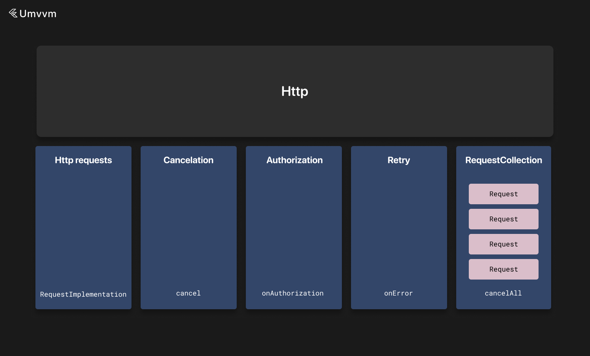

# APIs



API definition consists of implementing a base HTTP request class and defining API declarations.

### Base Request Class

The library contains a default implementation of the interface for [Dio](https://pub.dev/packages/dio).

To use this method, first you need to subclass `DioRequest`.

The generic parameter here represents the type of object to be returned from the request after parsing.

```dart
class HttpRequest<T> extends DioRequest<T> {
  @override
  RequestSettings get defaultSettings => RequestSettings(
        logPrint: (message) {
          if (kDebugMode) {
            print(message);
          }
        },
        exceptionPrint: (error, trace) {
          if (kDebugMode) {
            print(error);
            print(trace);
          }
        },
      );

  @override
  void onAuthorization(Dio dio) {
    if (token != null) {
      dio.options.headers['Authorization'] = 'Bearer $token';
    }
  }

  @override
  Future onError(DioException error, RetryHandler retry) async {
    return error;
  }
}
```

Here you can provide default settings for all requests.

Besides the parameters above, you can specify the default base URL, default headers, and default additional interceptors for requests.

You can also specify an authorization callback to add required headers to requests.

Additionally, you can specify an error callback where you can return an error or call the retry handler.

You can then use these requests as follows:

```dart
Future<void> loadPosts(int offset, int limit, {bool refresh = false}) async {
    updateState(state.copyWith(posts: LoadingData()));

    late Response<List<Post>> response;

    if (refresh) {
      response = await Apis.posts.getPosts(0, limit).execute();
    } else {
      response = await Apis.posts.getPosts(offset, limit).execute();
    }

    if (response.isSuccessful) {
      updateState(state.copyWith(posts: SuccessData(response.result ?? [])));
    } else {
      updateState(state.copyWith(posts: ErrorData(response.error)));
    }
}
```

You can later cancel a request with the `cancel` method:

```dart

Future<void> loadPosts(int offset, int limit, {bool refresh = false}) async {
    updateState(state.copyWith(posts: LoadingData()));

    late Response<List<Post>> response;

    final request = Apis.posts.getPosts(0, limit);

    unawaited(request.execute());

    request.cancel();
}
```
### API Declaration

API classes represent API declarations for the app.

Typically, every API represents some service on the backend.

API classes contain getters or functions that return `BaseRequest`.

API classes must be annotated with the `api` annotation.

`HttpRequest` has the following fields:

```dart

this.method = RequestMethod.get,
this.url,
this.parser,
this.query,
this.timeout = const Duration(seconds: 20), // connectTimeout + receiveTimeout
this.headers = const {},
this.body,
this.baseUrl,
this.requiresLogin = true,
this.databaseGetDelegate,
this.databasePutDelegate,
this.simulateResponse,
this.simulateResult,
this.formData,
this.ignoreCancelations = false,
this.onPrefetchFromDatabase,
this.additionalInterceptors = const [],
```

Important notes here:

1. `parser` is a function that takes the server response body and headers;
    
2. `simulateResponse` lets you simulate an unparsed server response body and headers so you can check the parser function and database delegates;
    
3. `simulateResult` lets you simulate a parsed server response so you can check interactors and view models;
    
4. If `body` is a `Map` or `List`, it will be encoded to JSON automatically.
    

A typical example of an API class would be:

```dart
@api
class PostsApi {
  HttpRequest<List<Post>> getPosts(int offset, int limit) => HttpRequest<List<Post>>()
    ..method = RequestMethod.get
    ..baseUrl = getBaseUrl(BackendUrls.main)
    ..url = '/posts'
    ..parser = (result, headers) async {
      final list = <Post>[];

      result?.forEach((data) {
        list.add(Post.fromJson(data));
      });

      return list;
    };
}
```

A typical example of API mocks for tests:

```dart

class MockPostsApiResponse extends PostsApi {
  @override
  HttpRequest<List<Post>> getPosts(int offset, int limit) => super.getPosts(offset, limit)
    ..simulateResponse = SimulateResponse(
      data: [{'id': 1, 'title': 'qwerty', "body": 'qwerty' }],
    );
}

class MockPostsApiResult extends PostsApi {
  @override
  HttpRequest<List<Post>> getPosts(int offset, int limit) => HttpRequest<List<Post>>()
    ..simulateResult = Response(code: 200, result: [
      Post(
        title: '',
        body: '',
        id: 1,
      )
    ]);
}
```

More information about testing can be found [here](https://./testing.md).

### Database or Cache Delegates

If a project requires a database, we can use any database such as `ObjectBox`, `Hive`, or `Isar` library and add delegates to `HttpRequest` if needed.

Here is an example:

```dart
HttpRequest<List<Post>> getPosts(int offset, int limit) => HttpRequest<List<Post>>()
    ..method = RequestMethod.get
    ..baseUrl = getBaseUrl(BackendUrls.main)
    ..url = '/posts'
    ..parser = (result, headers) async {
        final list = <Post>[];

        result?.forEach((data) {
          list.add(Post.fromJson(data));
        });

        return list;
    }
    ..databaseGetDelegate = ((headers) => PostsBox.getPostsDelegate(offset, limit, headers))
    ..databasePutDelegate = ((result) => PostsBox.putPostsDelegate(result));
```

Where delegates look like:

```dart

class PostsBox {
  static Future<List<Post>> getPostsDelegate(int offset, int limit, Map? headers) async {
    final postsBox = App.objectBox.store.box<Post>();

    final query = postsBox.query().build();

    query
      ..offset = offset
      ..limit = limit;

    final List<Post> posts = query.find();

    return posts;
  }

  static Future putPostsDelegate(List<Post> result) async {
    final postsBox = App.objectBox.store.box<Post>();

    postsBox.putMany(result);
  }
}
```

Here, for example, we created a class with static methods, but this can be done with a custom `MvvmInstance`.

More info about custom MVVM instances can be found [here](https://./custom_instances.md).

After you initialize all request fields, you can use it as follows:

```dart

Future<void> loadPosts(int offset, int limit, {bool refresh = false}) async {
    updateState(state.copyWith(posts: LoadingData()));

    late Response<List<Post>> response;

    if (refresh) {
      response = await Apis.posts.getPosts(0, limit).execute();
    } else {
      response = await Apis.posts.getPosts(offset, limit).execute();
    }

    if (response.isSuccessful || response.isSuccessfulFromDatabase) {
      updateState(state.copyWith(posts: SuccessData(response.result ?? [])));
    } else {
      updateState(state.copyWith(posts: ErrorData(response.error)));
    }
}
```
### Authorization and Errors

To process errors and retry requests, override the `onError` method.

Using an instance of `requestsCollection`, you can cancel all current requests and retry all of them.

```dart

await requestCollection.cancelAllRequests(
  retryRequestsAfterProcessing: true,
  cancelReasonProcessor: () async {
    await authorizationInteractor.requestNewToken(reAuth: true);
  },
);
```

You can pass a cancel reason processor future and the `retryRequestsAfterProcessing` flag; in this case, all currently running requests in the app will be paused while `cancelReasonProcessor` is executing and then will be retried without errors. If this flag is not passed, then all currently running requests will be canceled with a canceled error.

Here is an example:

```dart

class HttpRequest<T> extends DioRequest<T> {
  @override
  RequestSettings get defaultSettings => RequestSettings(
        logPrint: (message) {
          if (kDebugMode) {
            print(message);
          }
        },
        exceptionPrint: (error, trace) {
          if (kDebugMode) {
            print(error);
            print(trace);
          }
        },
      );

  @override
  void onAuthorization(Dio dio) {
    if (!requiresLogin) {
      return;
    }

    final token = app.instances
        .get<AuthorizationInteractor>()
        .state
        .token;

    if (token != null) {
      dio.options.headers['Authorization'] = 'Bearer $token';
    }
  }

  @override
  Future onError(DioException error, RetryHandler retry) async {
    if (error.type == DioExceptionType.cancel) {
      return error;
    }

    if (error.response?.statusCode == 401) {
      final authorizationInteractor =
          app.instances.get<AuthorizationInteractor>();

      await requestCollection.cancelAllRequests(
        retryRequestsAfterProcessing: true,
        cancelReasonProcessor: () async {
          await authorizationInteractor.requestNewToken(reAuth: true);
        },
      );

      if (!authorizationInteractor.isAuthorized) {
        return error;
      }

      return retry();
    }

    return error;
  }
}
```
### Cancellation in ApiCallers

View models, interactors, and wrappers cancel all running requests when they are disposed.

This is because they contain the `ApiCaller` mixin.

To enable this behavior, execute requests with the `executeAndCancelOnDispose` method inside these instances or custom API callers.

```dart

// before
response = await app.apis.posts.getPosts(0, limit).execute();

// after
response = await executeAndCancelOnDispose(app.apis.posts.getPosts(0, limit));
```

If you do not want to cancel a request—for example, if it is some important POST request—use the request as usual.

More info about custom API callers can be found [here](https://./custom_instances.md).