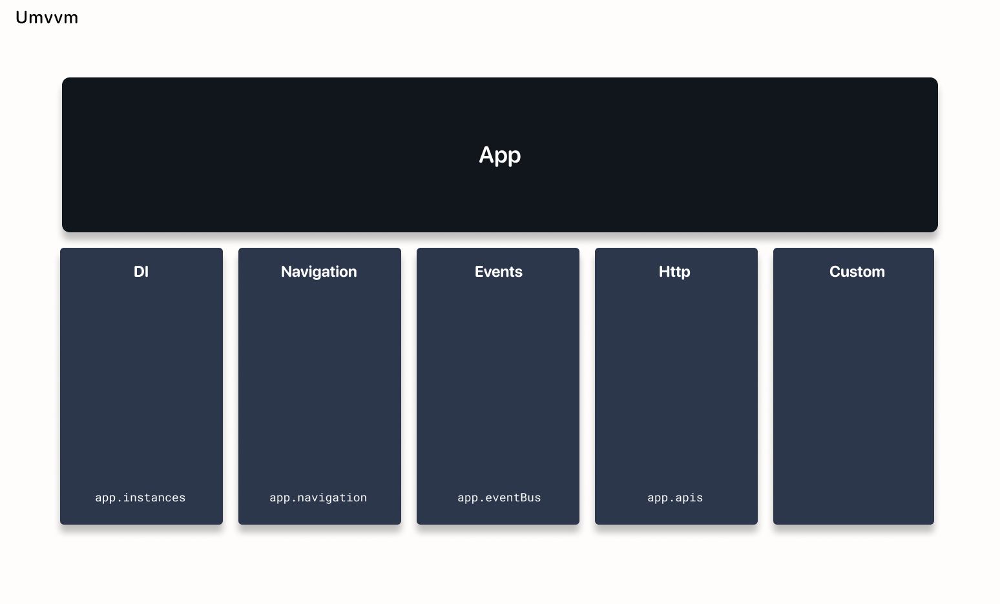

# App



The App is the main class that holds and connects Umvvm architecture components such as the event bus and instance collection.

The App exists as a global object or singleton.

You must initialize the app before the `runApp` call.

If you are using APIs, then you can store the `Apis` reference in the main app.

More information about the HTTP component can be found [here](./apis.md).

For example, here is the definition of a main app class:

```dart
@mainApp
class App extends UMvvmApp with AppGen {
  late SharedPreferences prefs;
  late ObjectBox objectBox;
  final apis = Apis();

  @override
  Future<void> initialize() async {
    await super.initialize();
  }
}

final app = App();

Future<void> main() async {
  await app.initialize();

  runApp(AppView(
    key: AppView.globalKey,
  ));
}
```

If your app uses the navigation component, you need to specify the navigation interactor type in the app declaration.

Here is an example:

```dart

@MainApp(navigationInteractorType: NavigationInteractor)
class App extends UMvvmApp<NavigationInteractor> with AppGen {
  final localStorage = SecureStorage();
  final apis = Apis();
  final boxes = Boxes();

  @override
  Future<void> initialize() async {
    await super.initialize();
  }
}
```

More information about the navigation component can be found [here](https://./navigation.md).

Be aware that if you create a separate isolate, it will contain a new independent app instance.

If your app uses caching for stateful instances, you need to specify cache delegates for this app.

Example:

```dart

Future<void> _initLocalStorage() async {
  await app.localStorage.initialize();

  UMvvmApp.cacheGetDelegate = app.localStorage.getString;
  UMvvmApp.cachePutDelegate = app.localStorage.putString;
}
```

In the example above, `localStorage` can be any library for caching, for example, `SharedPreferences` or `SecureStorage`.