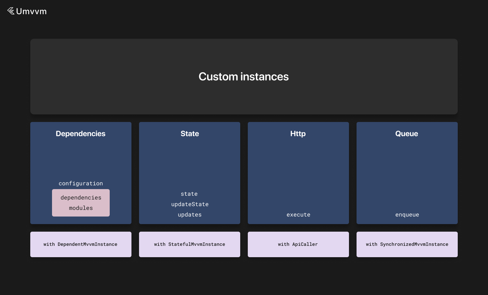

# Custom mvvm instances



You can create custom mvvm instances by extending <b>MvvmInstance</b>. There are also predefined mixins for main functions like dependencies and state.

You also need to specify input type for custom instances. It is passed as generic argument.

Input is always available via <b>input</b> field.

You can read about default methods of <b>MvvmInstance</b> [here](./mvvm_instance.md).

Here we will discuss mixins.

There are mixins that allow you to add additional funtions to your custom instance like dependencies, cancelable api calls and state.

### StatefulMvvmInstance

For example - if you need to add state to your custom mvvm instance you can write this:

```dart
abstract class BaseBox<State> extends MvvmInstance<dynamic> with StatefulMvvmInstance<State, dynamic> {
  String get boxName;

  late final hiveWrapper = app.instances.get<HiveWrapper>();

  @mustCallSuper
  @override
  void initialize(Input? input) {
    super.initialize(input);

    initializeStatefulInstance();

    initialized = true;
  }

  @mustCallSuper
  @override
  void dispose() {
    super.dispose();

    disposeStore();

    initialized = false;
  }
}
```

You need to add initialization call to <b>initialize</b> method and <b>disposeStore</b> method to <b>dispose</b> override.

Then you can extend this custom instance and use if state and receive updates, restore cache and etc..

```dart
@MappableClass()
class UsersBoxState with UsersBoxStateMappable {
  const UsersBoxState({
    this.id,
    this.users,
  });

  final String? id;
  final List<User>? users;
}

@basicInstance
class UsersBox extends BaseBox<UsersBoxState> {
  void updateUsers(List<User> users) {
    updateState(state.copyWith(users: users));
  }

  Stream<List<User>?> get usersStream => updates((state) => state.users);
}

class UsersListViewModel extends BaseViewModel<UsersListView, UsersListViewState> {
  @override
  DependentMvvmInstanceConfiguration get configuration =>
    DependentMvvmInstanceConfiguration(
      dependencies: [
        app.usersBoxConnector(isLazy: true),
      ],
    );

  late final usersInteractor = getLocalInstance<UsersBox>();

  @override
  void onLaunch() {
    // called with initState
    getLocalInstance<PostsInteractor>().loadPosts(0, 30);
  }

  Stream<StatefulData<List<Post>>?> get usersStream => usersInteractor.usersStream;

  @override
  PostsListViewState get initialState => PostsListViewState();
}
```

### DependentMvvmInstance

If you need to add dependencies to your custom mvvm instance you can do the following:

```dart
abstract class BaseBox extends MvvmInstance<dynamic> with DependentMvvmInstance<dynamic> {
  String get boxName;

  late final hiveWrapper = app.instances.get<HiveWrapper>();

  @mustCallSuper
  @override
  void initialize(dynamic input) {
    super.initialize(input);

    initializeDependencies();

    initialized = true;
  }

  @mustCallSuper
  @override
  Future<void> initializeAsync() async {
    await super.initializeAsync();

    await initializeDependenciesAsync();

    initialized = true;
  }

  @mustCallSuper
  @override
  void dispose() {
    super.dispose();

    disposeDependencies();

    initialized = false;
  }
}
```

You need to add initialization call to <b>initialize</b> method and <b>disposeDependencies</b> method to <b>dispose</b> override.

You also need to add <b>initializeDependenciesAsync</b> in <b>initializeAsync</b> method.

Then you can extend this custom instance and use dependencies, <b>getLocalInstance</b> method and etc...

```dart
@basicInstance
class UsersBox extends BaseBox {
  @override
  DependentMvvmInstanceConfiguration get configuration =>
    DependentMvvmInstanceConfiguration(
      dependencies: [
        app.connectors.postInteractorConnector(
          scope: BaseScopes.unique,
          input: input.post,
        ),
      ],
    );

  late final postInteractor = getLocalInstance<PostInteractor>();
}
```

### ApiCaller

If you need to execute http requests in your custom mvvm instance you can add <b>ApiCaller</b> mixin so that requests can be cancelled automatically when instance is disposed.

You can do it as follows:

```dart
abstract class BaseBox extends MvvmInstance<dynamic> with ApiCaller<dynamic> {
  String get boxName;

  late final hiveWrapper = app.instances.get<HiveWrapper>();

  @mustCallSuper
  @override
  void dispose() {
    super.dispose();

    cancelAllRequests();

    initialized = false;
  }
}
```

### Custom configuration objects

If you want to provide additional configuration for your custom mvvm instance you can subclass <b>MvvmInstanceConfiguration</b>.

If your custom mvvm instance is using dependencies you need to subclass <b>DependentMvvmInstanceConfiguration</b>.

Here is an example:

```dart
class CustomtMvvmInstanceConfiguration extends MvvmInstanceConfiguration {
  const CustomtMvvmInstanceConfiguration({
    super.parts = const [],
    super.isAsync,
    this.customFlag = false,
  });

  final bool customFlag;
}

// or
class CustomtMvvmInstanceConfiguration extends DependentMvvmInstanceConfiguration {
  const CustomtMvvmInstanceConfiguration({
    super.parts,
    super.isAsync,
    super.dependencies = const [],
    super.modules = const []
    this.customFlag = false,
  });

  final bool customFlag;
}

abstract class BaseBox extends MvvmInstance<dynamic> with DependentMvvmInstance<dynamic> {
  String get boxName;

  late final hiveWrapper = app.instances.get<HiveWrapper>();

  @override
  CustomtMvvmInstanceConfiguration get configuration => const CustomtMvvmInstanceConfiguration();

  @mustCallSuper
  @override
  void initialize(dynamic input) {
    super.initialize(input);

    initializeDependencies();

    initialized = true;
  }

  @mustCallSuper
  @override
  Future<void> initializeAsync() async {
    await super.initializeAsync();

    await initializeDependenciesAsync();

    initialized = true;
  }

  @mustCallSuper
  @override
  void dispose() {
    super.dispose();

    disposeDependencies();

    initialized = false;
  }
}
```
