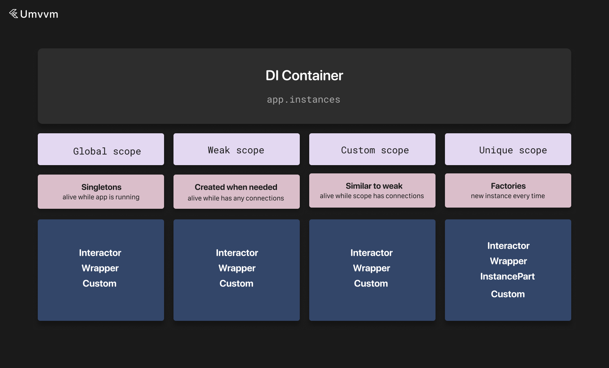
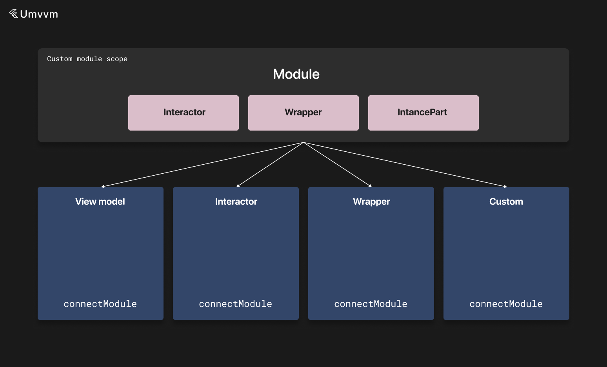

# DI



The library contains a simple DI container.

You can access it with `app.instances` or via the singleton `InstanceCollection`.

The DI container can hold any annotated `MvvmInstance` child class but not any other.

If you want to hold a third-party instance, create a wrapper for it.

More information about wrappers can be found [here](./wrapper.md).

The DI container is divided into scopes, which are basically subcontainers.

Using scopes, you can create unique instance spaces that will be automatically disposed when every dependent instance is disposed.

You can also define modules that describe dependency collections. More information about modules is provided below.

Every scope can contain one or a list of objects of a given type. If a scope contains multiple instances of the same type, you need to specify the index when you are trying to create or get the object.

More information about scopes is provided below.

### Defining Instances

There are several ways to annotate MVVM instances to use in the DI container: `singleton` and `basicInstance` annotations (or async and lazy analogues described below) and the full `Instance` annotation.

It is required to define the input type for instances. It is passed as a generic argument.

Singleton instances belong to the global scope and they are initialized at app startup. If a singleton is `isLazy`, then it will be created only when accessed for the first time.

Here are some examples:

```dart
@Instance(inputType: String)
class StringWrapper extends BaseWrapper<String> {}

```

or basic instance wrapper:

```dart
@basicInstance
class StringWrapper extends BaseWrapper<Map<String, dynamic>> {}

```

or singleton wrapper:

```dart
@singleton
class StringWrapper extends BaseWrapper<Map<String, dynamic>> {}

```

or lazy singleton wrapper:

```dart
@lazySingleton
class StringWrapper extends BaseWrapper<Map<String, dynamic>> {}

```

### Async Initialization

If you want to create an MVVM instance that is initialized asynchronously, you can pass the `async` param to the `Instance` annotation, or you can use predefined default annotations.

**Important:** You must mark instances as async if they depend on other async instances.

Then you can get async instances with the `getAsync` method.

Here are some examples:

```dart
@asyncLazySingleton
class StringWrapper extends BaseWrapper<Map<String, dynamic>> {
  @override
  DependentMvvmInstanceConfiguration get configuration =>
    DependentMvvmInstanceConfiguration(
      isAsync: true,
    );
}

```

```dart
@asyncSingleton
class StringWrapper extends BaseWrapper<Map<String, dynamic>> {
  @override
  DependentMvvmInstanceConfiguration get configuration =>
    DependentMvvmInstanceConfiguration(
      isAsync: true,
    );
}

```

```dart
@asyncBasicInstance
class StringWrapper extends BaseWrapper<Map<String, dynamic>> {
  @override
  DependentMvvmInstanceConfiguration get configuration =>
    DependentMvvmInstanceConfiguration(
      isAsync: true,
    );
}

```

```dart
@Instance(isAsync: true, initializationOrder: 1, awaitInitialization: true, singleton: true)
class StringWrapper extends BaseWrapper<Map<String, dynamic>> {
  @override
  DependentMvvmInstanceConfiguration get configuration =>
    DependentMvvmInstanceConfiguration(
      isAsync: true,
    );
}

```

In the last example, there is also an `initializationOrder` field that is used to specify the order of singleton initialization. This only matters for singleton async instances.

If this field is specified, the `awaitInitialization` value must also be set to true.

This flag indicates that the app creation process will await the initialization of this instance. This only matters for async singleton instances.

You also need to specify the `isAsync` flag in the configuration object for an async instance.

You can also override the `initializeAsync` method for async instances.

Here is an example of an async instance:

```dart
@asyncSingleton
class UserDefaultsInteractor extends BaseInteractor<UserDefaultsState, Map<String, dynamic>> {
  @override
  UserDefaultsState get initialState => UserDefaultsState();

  @override
  DependentMvvmInstanceConfiguration get configuration =>
    DependentMvvmInstanceConfiguration(
      isAsync: true,
    );

  @override
  Future<void> initializeAsync() async {
    // ...
  }

  @override
  Future<void> dispose() async {
    // ...
  }
}

```

You don't need to specify the `isAsync` flag in the configuration object if you use async dependencies; this is done automatically. You only need to specify it in the annotation.

Async instances also have a method to handle dependency ready status:

```dart
@asyncSingleton
class UserDefaultsInteractor extends BaseInteractor<UserDefaultsState, Map<String, dynamic>> {
  @override
  UserDefaultsState get initialState => UserDefaultsState();

  @override
  DependentMvvmInstanceConfiguration get configuration =>
    DependentMvvmInstanceConfiguration(
      isAsync: true,
    );

  @override
  Future<void> initializeAsync() async {
    // ...
  }

  @override
  Future<void> dispose() async {
    // ...
  }

  @override
  void onAsyncInstanceReady(Type type, {int? index}) {
    switch (type) {
      case value:
        
        break;
      default:
        break;
    }
  }
}
```

Async local instances can be accessed safely only after `onAsyncInstanceReady` is fired for this instance.

You can unregister instances with the `app.instances.unregisterInstance` method. This is useful when you need a singleton instance but only for some time. This way, after the instance is used, you can unregister and dispose of it.

### Accessing Instances with Global Instances Interface

Instances can be obtained using `app.instances.get<T>()` or analogues for async, etc.

The instance collection ensures that the object is initialized before you access it.

When you try to get an instance from the collection, it will be initialized first, then all dependencies of this instance will be initialized, and so on. At the end, you will get a fully initialized object, and every dependency in the dependency tree of this object will also be initialized.

If you want to skip the initialization of instance dependencies (for example, if you need to just call some method from an instance that doesn't require any of the dependencies to be processed), you can pass the `withoutConnections` flag to `app.instances.get<T>()` or analogues.

If you need to access a singleton instance or you need to get an object in some scope, you can use `app.instances.get<T>()` anywhere in the code.

Here are some examples of how you can access instances:

```dart
Future<Instance> getUniqueAsync<Instance extends MvvmInstance>({bool withoutConnections});

Future<Instance> getUniqueWithParamsAsync<Instance extends MvvmInstance, InputState>({
  InputState? params,
  bool withoutConnections = false,
});

Future<Instance> getAsync<Instance extends MvvmInstance>({
  DefaultInputType? params,
  int? index,
  String scope = BaseScopes.global, 
  bool withoutConnections = false,
});

Future<Instance> getWithParamsAsync<Instance extends MvvmInstance, InputState>({
  InputState? params,
  int? index,
  String scope = BaseScopes.global, 
  bool withoutConnections = false,
});

Instance getUnique<Instance extends MvvmInstance>({
  DefaultInputType? params,
  bool withoutConnections = false,
});

Instance getUniqueWithParams<Instance extends MvvmInstance, InputState>({
  InputState? params,
  bool withoutConnections = false,
});

Instance get<Instance extends MvvmInstance>({
  DefaultInputType? params,
  int? index,
  String scope = BaseScopes.global,
  bool withoutConnections = false,
});

Instance getWithParams<Instance extends MvvmInstance, InputState>({
  InputState? params,
  int? index,
  required String scope,
  bool withoutConnections = false,
});
```

### Accessing Instances Inside Dependent Instances

When you are inside any `DependentInstance` (interactors, wrappers, view models, and any custom MVVM instance that mixes `DependentInstance`), then you can write dependencies and they will be connected automatically when the instance is initialized. Also, when the instance is disposed, every dependency will be disposed automatically (more information about `DependentInstance` can be found [here](./custom_instances.md)).

To enable this behavior, you need to override the `dependencies` field in the configuration object.

The configuration object is provided via the `configuration` getter for every dependent MVVM instance.

This method returns a list of connector objects that describe how the dependency is required to be connected. More information about connectors can be found [here](./connectors.md).

Then you need to access the object with `getLocalInstance` rather than `app.instances.get<T>()`.

Singleton instances are always accessed with `app.instances.get<T>()`. And you do not need to write them in the dependencies list.

Here is an example:

```dart
@basicInstance
class PostsInteractor extends BaseInteractor<PostsState, Map<String, dynamic>> with LikePostMixin {
  @override
  DependentMvvmInstanceConfiguration get configuration =>
    DependentMvvmInstanceConfiguration(
      dependencies: [
        const Connector(type: SupportInteractor, scope: BaseScopes.unique),
        const Connector(type: ReactionsWrapper),
      ],
      // more info about modules below
      modules: [
        Modules.test,
      ],
    );

  late final supportInteractor = getLocalInstance<SupportInteractor>();
  late final reactionsWrapper = getLocalInstance<ReactionsWrapper>();

  late final authorizationWrapper = app.instances.get<AuthorizationWrapper>();

  @override
  PostsState get initialState => PostsState();
}
```

### Accessing Parts

Parts are always unique. So you can get them with the `getUnique` and `getUniqueAsync` methods.

If you get a part with this method, `parentInstance` will be uninitialized.

If you are inside any `MvvmInstance`, you can connect parts via the `parts` field in the configuration object.

Parts are connected via `PartConnector`. More information about connectors can be found [here](./connectors.md).

Then you can get the instance with the `useInstancePart` method.

Here is an example:

```dart
@override
DependentMvvmInstanceConfiguration get configuration =>
  DependentMvvmInstanceConfiguration(
    parts: [
      const PartConnector(type: TestInstancePart, isAsync: true, input: 6),
    ],
  );

late final testInstancePart = useInstancePart<TestInstancePart>();
```

### Scopes

A scope is a subcontainer where you can store independent instances.

Scopes are defined by unique string identifiers.

There are several predefined scopes—global, unique, and weak:

1) Global scope (`BaseScopes.global`) holds singleton instances;
2) Weak scope (`BaseScopes.weak`) holds objects that can be accessed from anywhere as long as some MVVM instance is connected to it;
3) Unique scope (`BaseScopes.unique`) always creates a new instance.

You can define your own scopes.

In this case, an instance in this scope will be alive as long as there is an object that depends on this instance. It is similar to `BaseScopes.weak` behavior, but in a subcontainer rather than in the global container.

To specify the scope that you want an object from, you can pass the scope param to the `get` method.

```dart
app.instances.get<UserInteractor>(scope: CustomScopes.userProfileScope('1'));
```

You can also specify the scope in connector objects (more information about connectors can be found [here](./connectors.md)):

```dart
@override
DependentMvvmInstanceConfiguration get configuration =>
  DependentMvvmInstanceConfiguration(
    dependencies: [
      app.connectors.userInteractorConnector(
        scope: CustomScopes.userProfileScope(input.user?.id ?? ''),
        input: UserInteractorInput(username: input.user?.username),
      ),
    ],
  );
```

Then you can get the instance with the `getLocalInstance` method.

### Modules



Modules are simple classes that help to organize dependencies.

If your classes depend on a similar set of scoped instances, you can combine them using `InstanceModule`.

All dependencies in a module will be disposed when there are no instances that belong to this module.

You can also define typical parts for this module that will be connected for every instance that belongs to the given module.

Dependencies are represented with `Connector` objects. More information about connectors can be found [here](./connectors.md).

When you define a dependent instance that belongs to a given module, all dependencies from this module will be connected automatically.

You can also store instances here so you can access them inside a dependent class. Instances are initialized with the same methods as other dependent instances: `getLazyLocalInstance`, `getAsyncLazyLocalInstance`, `getLocalInstance`, and `useInstancePart`. This way, you do not need to write initializers in every dependent class.

Here is an example:

```dart
class TestModule extends InstancesModule {
  @override
  List<Connector> get dependencies => [
        app.connectors.postInteractorConnector(),
        app.connectors.userInteractorConnector(),
      ];

  @override
  List<PartConnector> get parts => [
        app.connectors.loadUserPartConnector(),
        app.connectors.followUserPartConnector(),
      ];

  late final postInteractor = getLocalInstance<PostInteractor>();
  late final userInteractor = getLazyLocalInstance<UserInteractor>();
  late final loadUserPart = useInstancePart<LoadUserPart>();
  late final followUserPart = getAsyncLazyLocalInstance<FollowUserPart>();

  @override
  String get id => 'test';
}

class Modules {
  static get test => TestModule();
}

@singleton
class StringWrapper extends BaseWrapper<Map<String, dynamic>> {
  @override
  DependentMvvmInstanceConfiguration get configuration =>
    DependentMvvmInstanceConfiguration(
      modules: [
        Modules.test,
      ],
    );
}
```

You do not need to write singleton dependencies in the module dependencies list.

If you decide to store dependency instances inside a module, you need to connect this module so you can access it. You can do it with the `connectModule` method.

**Important:** Module instances passed to the `modules` field must be unique.

Here is an example:

```dart
@singleton
class StringWrapper extends BaseWrapper<Map<String, dynamic>> {
  @override
  DependentMvvmInstanceConfiguration get configuration =>
    DependentMvvmInstanceConfiguration(
      modules: [
        TestModule(),
      ],
    );

  late final testModule = connectModule<TestModule>();

  void someFunction() {
    testModule.postInteractor.loadPost();
  }
}
```

### Utility Functions

You can also enable runtime check for cyclic dependencies with the `instances.checkForCyclicDependencies` flag. This flag is false by default.

It is recommended to enable this only in debug or stage modes.

You can also quickly get and use an instance and dispose of it afterward automatically with `app.instances.useAndDisposeInstance` and `app.instances.useAndDisposeInstanceWithParams`.

Here is an example:

```dart
app.instances.useAndDisposeInstance<StoreRedirectWrapper>((storeRedirectWrapper) async {
    await storeRedirectWrapper.openStore();
});
```

You can also check if all dependencies are connected to an instance and check if all parts are connected to an instance. You can also override callbacks for it.

Here is an example:

```dart
@asyncSingleton
class UserDefaultsInteractor extends BaseInteractor<UserDefaultsState, Map<String, dynamic>> {
  @override
  UserDefaultsState get initialState => UserDefaultsState();

  @override
  DependentMvvmInstanceConfiguration get configuration =>
    DependentMvvmInstanceConfiguration(
      isAsync: true,
    );

  @override
  Future<void> initializeAsync() async {
    // ...
  }

  @override
  Future<void> dispose() async {
    // ...
  }

  @override
  void onAsyncInstanceReady(Type type, {int? index}) {
    switch (type) {
      case value:
        
        break;
      default:
        break;
    }
  }

  @override
  void onAllDependenciesReady() {
    // ...
  }

  @override
  void onAllPartReady() {
    // ...
  }
}

final userDefaultsInteractor = app.instances.get<UserDefaultsInteractor>();

final isEverythingConnected = userDefaultsInteractor.allDependenciesReady.current;
final isPartsConnected = userDefaultsInteractor.allPartsReady.current;
```