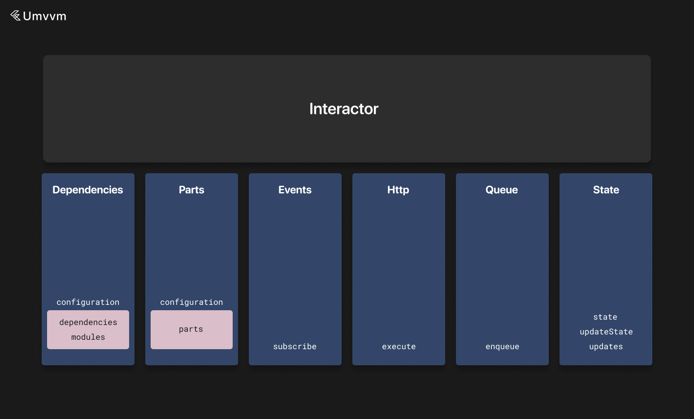

# Interactors



Interactors contain state and subscription to `EventBus` events (more information about `EventBus` can be found [here](./event_bus.md)).

You also need to specify the input type for interactors. It is passed as a generic argument.

Input is always available via the `input` field.

Interactor state can be any immutable object. You can use `dart-mappable` or `freezed` libraries (or any other object generation libraries).

State can be updated with the `updateState` method, and receivers like view models can later subscribe to state update events with `updates` or `changes` (`changes` returns a stream of old and new values in the object, `updates` returns a stream of new object values).

There is also a `wrapUpdates` method that returns a `Stream` for a given mapper and also exposes the current value—it simplifies work with `StreamBuilder`. Instead of creating a `Stream` getter with the `updates` method and a getter for the current value, you can use this method to get an object that wraps these getters, and you can use the `stream` field and `current` getter. And also there is a `wrapChanges` analogue for the `changes` method.

Interactors must be annotated with `basicInstance`, `singleton`, or the full `Instance` annotation.

When an interactor is annotated as a singleton, it belongs to the global instance collection.

We don't need to write dependencies in our instances for singleton interactors, and we can access them with `app.instances`.

Interactors can also depend on other interactors and [wrappers](./wrapper.md) (or [custom instances](./custom_instance.md)) via the `dependencies` field in the configuration object.

The configuration object is provided via the `configuration` getter for every interactor.

Interactors can also contain [parts](./instance_part.md) via the `parts` field in the configuration object.

Interactors can also belong to modules via the `modules` field in the configuration object (information about modules can be found [here](./di.md)).

They are connected with `Connector` objects (more information about connectors can be found [here](./connectors.md) and for DI [here](./di.md)).

A typical example would be:

```dart
// Map<String, dynamic> - input type
// PostsState - state type
@basicInstance
class PostsInteractor extends BaseInteractor<PostsState, Map<String, dynamic>> with LikePostMixin {
  @override
  DependentMvvmInstanceConfiguration get configuration =>
    DependentMvvmInstanceConfiguration(
      dependencies: [
        const Connector(type: SupportInteractor, scope: BaseScopes.unique),
        const Connector(type: ReactionsWrapper),
      ],
    );

  late final supportInteractor = getLocalInstance<SupportInteractor>();
  late final reactionsWrapper = getLocalInstance<ReactionsWrapper>();

  Future<void> loadPosts(int offset, int limit, {bool refresh = false}) async {
    updateState(state.copyWith(posts: LoadingData()));

    late Response<List<Post>> response;

    if (refresh) {
      response = await app.apis.posts.getPosts(0, limit).execute();
    } else {
      response = await app.apis.posts.getPosts(offset, limit).execute();
    }

    if (response.isSuccessful || response.isSuccessfulFromDatabase) {
      updateState(state.copyWith(posts: SuccessData(response.result ?? [])));
    } else {
      updateState(state.copyWith(posts: ErrorData(response.error)));
    }
  }

  void _onPostLiked(int id) {
    final posts = (state.posts as SuccessData<List<Post>>).result.toList();
    final index = posts.indexWhere((element) => element.id == id);

    if (index == -1) {
      return;
    }

    posts[index] = posts[index].copyWith(isLiked: !posts[index].isLiked);

    updateState(state.copyWith(posts: SuccessData(posts)));
  }

  late final posts = wrapUpdates((state) => state.posts);

  @override
  PostsState get initialState => PostsState();

  @override
  List<EventBusSubscriber> subscribe() => [
      on<PostLikedEvent>((event) {
        _onPostLiked(event.id);
      }),
    ];
}
```

Or a singleton interactor:

```dart
@singleton
class UserDefaultsInteractor extends BaseInteractor<UserDefaultsState, Map<String, dynamic>> {
  @override
  void onRestore(Map<String, dynamic> savedStateObject) {
    updateState(UserDefaultsState.fromJson(savedStateObject));
  }

  void saveFirstAppLaunch() {
    updateState(state.copyWith(firstAppLaunch: true));
  }

  @override
  UserDefaultsState get initialState => UserDefaultsState();
  
  @override
  Map<String, dynamic> get savedStateObject => state.toJson();

  @override
  StateFulInstanceSettings get stateFulInstanceSettings =>
      StateFulInstanceSettings(
        stateId: state.runtimeType.toString(),
        isRestores: true,
      );
  
  @override
  List<EventBusSubscriber> subscribe() => [
      on<PostLikedEvent>((event) {
        _onPostLiked(event.id);
      }),
    ];
}

```

In the last example, we can also see that every interactor also has `savedStateObject`.

When we override `savedStateObject`, the interactor can save state to `SharedPreferences` or other providers such as `SecureStorage`.

To enable it, you need to override the `stateFulInstanceSettings` getter and set the `isRestores` flag to true.

Later, state can be restored with the `onRestore` callback.

By default, the state key for the saved object is equal to the state runtime type string, but you can override it with the `stateId` field in `stateFulInstanceSettings`. If the app uses obfuscation, this is **required**.

You can also specify the input type for every interactor in the annotation:

```dart
@Instance(inputType: String)
class UserDefaultsInteractor extends BaseInteractor<UserDefaultsState, String> {
  @override
  void onRestore(Map<String, dynamic> savedStateObject) {
    updateState(UserDefaultsState.fromJson(savedStateObject));
  }

  void saveFirstAppLaunch() {
    updateState(state.copyWith(firstAppLaunch: true));
  }

  @override
  UserDefaultsState get initialState => UserDefaultsState();
  
  @override
  Map<String, dynamic> get savedStateObject => state.toJson();

  @override
  StateFulInstanceSettings get stateFulInstanceSettings =>
      StateFulInstanceSettings(
        stateId: state.runtimeType.toString(),
        isRestores: true,
        syncRestore: false,
      );
  
  @override
  List<EventBusSubscriber> subscribe() => [
      on<PostLikedEvent>((event) {
        _onPostLiked(event.id);
      }),
    ];
}
```

In the example above, we also specify the `syncRestore` option. If this option is set to true, the state will be restored from the cache during the `initialize` call. Otherwise, it will be restored asynchronously.

And here is an example of the declaration of all types of dependencies:

```dart
@basicInstance
class PostsInteractor extends BaseInteractor<PostsState, Map<String, dynamic>> with LikePostMixin {
  @override
  DependentMvvmInstanceConfiguration get configuration =>
    DependentMvvmInstanceConfiguration(
      dependencies: [
        const Connector(type: SupportInteractor, scope: BaseScopes.unique),
        const Connector(type: ReactionsWrapper),
      ],
      modules: [
        Modules.test,
      ],
      parts: [
        const PartConnector(type: TestInstancePart1, input: 5, isAsync: true),
        const PartConnector(
            type: TestInstancePart2,
            isAsync: true,
            count: 2,
            input: 10,
        ),
        PartConnector(
            type: TestInstancePart3,
            count: 2,
            inputForIndex: (index) => index + 1,
        ),
        PartConnector(
            type: TestInstancePart4,
            isAsync: true,
            count: 2,
            inputForIndex: (index) => index + 1,
        ),
        const PartConnector(
            type: TestInstancePart5,
            withoutConnections: true,
        ),
      ],
    );

  late final supportInteractor = getLocalInstance<SupportInteractor>();
  late final reactionsWrapper = getLocalInstance<ReactionsWrapper>();

  late final testInstancePart1 = useInstancePart<TestInstancePart1>();

  Future<void> loadPosts(int offset, int limit, {bool refresh = false}) async {
    updateState(state.copyWith(posts: LoadingData()));

    late Response<List<Post>> response;

    if (refresh) {
      response = await app.apis.posts.getPosts(0, limit).execute();
    } else {
      response = await app.apis.posts.getPosts(offset, limit).execute();
    }

    if (response.isSuccessful || response.isSuccessfulFromDatabase) {
      updateState(state.copyWith(posts: SuccessData(response.result ?? [])));
    } else {
      updateState(state.copyWith(posts: ErrorData(response.error)));
    }
  }

  void _onPostLiked(int id) {
    final posts = (state.posts as SuccessData<List<Post>>).result.toList();
    final index = posts.indexWhere((element) => element.id == id);

    if (index == -1) {
      return;
    }

    posts[index] = posts[index].copyWith(isLiked: !posts[index].isLiked);

    updateState(state.copyWith(posts: SuccessData(posts)));
  }

  @override
  PostsState get initialState => PostsState();

  @override
  List<EventBusSubscriber> subscribe() => [
      on<PostLikedEvent>((event) {
        _onPostLiked(event.id);
      }),
    ];
}
```

There is also the ability to execute code in a synchronized queue—meaning that if there are currently running operations, new code will be executed after all previous operations complete; otherwise, the operation will be executed instantly.

By default, if an interactor is disposed, all pending operations are discarded, but this can be changed with the `discardOnDispose` flag. Also, you can provide an optional timeout for this operation.

```dart
@basicInstance
class PostsInteractor extends BaseInteractor<PostsState, Map<String, dynamic>> with LikePostMixin {
  Future<void> loadPosts(int offset, int limit, {bool refresh = false}) async {
    enqueue(operation: () async {
      updateState(state.copyWith(posts: LoadingData()));

      late Response<List<Post>> response;

      if (refresh) {
        response = await app.apis.posts.getPosts(0, limit).execute();
      } else {
        response = await app.apis.posts.getPosts(offset, limit).execute();
      }

      if (response.isSuccessful || response.isSuccessfulFromDatabase) {
        updateState(state.copyWith(posts: SuccessData(response.result ?? [])));
      } else {
        updateState(state.copyWith(posts: ErrorData(response.error)));
      }
    })
  }

  @override
  PostsState get initialState => PostsState();
}
```

To see base settings and methods of interactors, you can visit [this page](./mvvm_instance.md).