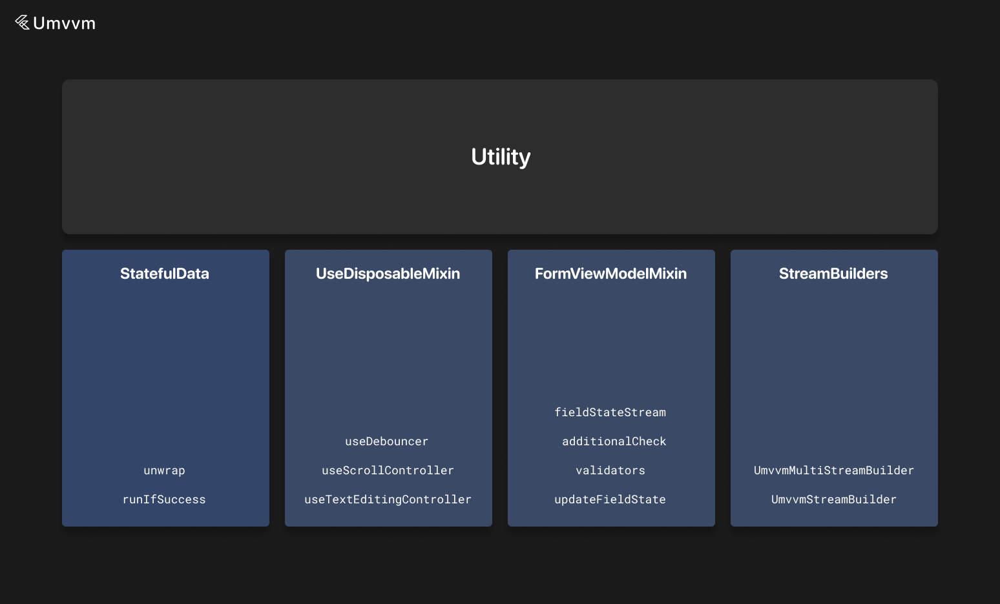

# Utility



The package contains small utility classes.

The first two are just sealed classes for operations result and field validation:

```dart
var statefulData = LoadingData();

statefulData.unwrap(); // throws error

statefulData = ErrorData(error: 'test error');

statefulData.unwrap(); // throws error

statefulData = SuccessData(result: 1);

statefulData.unwrap(); // valid

statefulData.is
```

Stateful data can be unwrapped to get the result value if it is present.

It is also possible to execute block of code only if value inside `StatefulData` is successful:

```dart
var value = 1;

statefulData.runIfSuccess((data) {
  value = 2;
});

// or async analogue

var value = 1;

await statefulData.runIfSuccessAsync((data) async {
  value = 2;
});

// or you can return value from this block

final result = statefulData.runIfSuccess((data) {
  return 2;
});

// or async analogue

final result = await statefulData.runIfSuccessAsync((data) async {
  return 2;
});
```

And here is a sealed class for field validation: it contains valid, error, and ignored states.

```dart
sealed class FieldValidationState {}

class ValidFieldState extends FieldValidationState {}

class IgnoredFieldState extends FieldValidationState {}

class ErrorFieldState extends FieldValidationState {
  final String? error;

  ErrorFieldState({this.error});
}
```

These values are used by `FormViewModelMixin`. More information about `FormViewModelMixin` is provided below.

There is also a `ResultState` class to hold function execution results:

```dart
ResultState.success(result: 'test');
ResultState.check(error: result.serverSideException);
ResultState.error(
  error: StandartEmptyException(),
  messageToDisplay: app.localization.authorization('login_error'),
);
```

You can also unwrap an error with a specific type using the `unwrapError` method.

```dart
Future<ResultState> confirmEmail(String link) async {
  final uri = Uri.parse(link);

  // ...

  if (error) {
    return ResultState.error(
      error: result.serverSideException!,
      messageToDisplay: app.localization.global('something_went_wrong'),
    );
  }

  return ResultState.success();
}

final confirmationResult = await confirmEmail(link);

final error = confirmationResult.unwrapError<ServerSideException>();
```

There are also two helper mixins that you can apply to your view models or instances.

#### UseDisposableMixin

`UseDisposableMixin` can be applied to any `MvvmInstance`.

It provides methods to initialize disposable objects like `TextEditingController`. They will be disposed automatically when the instance is disposed.

Here is the full list of supported initializers:

```dart
TextEditingController useTextEditingController({String? text});
ScrollController useScrollController();
Debouncer useDebouncer({required Duration delay});
```

Here is a use case example:

```dart
class SupportViewModel extends NavigationViewModel<SupportView, SupportViewState>
    with UseDisposableViewModelMixin {
  late final descriptionController = useTextEditingController();
  late final emailController = useTextEditingController();
}
```

#### FormViewModelMixin

`FormViewModelMixin` can be applied only to view models.

It helps to manage form views where you need to validate user input.

It contains a map of validators (keys of the map are `GlobalKey` so the form can automatically scroll to the error field if the user is trying to submit the form) and the `executeSubmitAction` method to call the form validation process. You need to pass these keys as parameters to your field widgets. Field widget implementation is up to the developer.

Validators can be manually updated:

```dart
updateFieldState(
  passwordKey,
  ErrorFieldState(error: result.messageToDisplay),
);
```

You can also manually call the validator for a field and reset the field with corresponding methods:

```dart
validateField(passwordKey);

resetField(passwordKey);
```

You can also override the `additionalCheck` method if you need to check some additional fields. It will be run after the validators check.

Here you can see an example:

```dart
class SupportViewModel
    extends NavigationViewModel<SupportView, SupportViewState>
    with FormViewModelMixin, UseDisposableViewModelMixin {
  late final descriptionController = useTextEditingController();
  late final emailController = useTextEditingController();

  final descriptionKey = GlobalKey();
  final emailKey = GlobalKey();

  @override
  Future<bool> additionalCheck() async {
    updateState(state.copyWith(
      platformPolicyIgnored: !state.platformPolicyApproved,
    ));

    return state.platformPolicyApproved;
  }

  @override
  Future<void> submit() async {
    await sendSupportRequest();
  }

  @override
  ValidatorsMap get validators => {
        descriptionKey: () {
          return Future.value(validateSupportTicket(descriptionController));
        },
        emailKey: () {
          return Future.value(validateEmail(emailController, []));
        },
      };

  @override
  SupportViewState get initialState => SupportViewState();
}
```

After initialization, you can use streams of validation states for fields that you specified:

```dart
WhatHappenedField(
  key: viewModel.descriptionKey,
  controller: viewModel.descriptionController,
  stateStream:
      viewModel.fieldStateStream(viewModel.descriptionKey),
  initialState: () =>
      viewModel.currentFieldState(viewModel.descriptionKey),
  validator: () =>
      viewModel.validatorForKey(viewModel.descriptionKey),
),

Button(
  onTap: () async {
    await viewModel.executeSubmitAction();
  },
);
```

#### StreamBuilders

The library contains simple analogues of `StreamBuilder` that allow you to pass `StateStream` (wrapper object to get stream and current value for a given state mapper)—`UmvvmStreamBuilder` and `UmvvmMultiStreamBuilder`. These widgets also allow you to pass `Stream` and `initialData` as usual if needed.

Here are examples:

```dart
UmvvmStreamBuilder<StatefulData<User>?>(
  streamWrap: viewModel.user,
  builder: (context, snapshot) {
    final userData = snapshot.data;

    if (userData is! SuccessData) {
      return const SizedBox.shrink();
    }

    final user = userData!.unwrap();

    return Text(user.name);
  },
);
```

```dart
UmvvmMultiStreamBuilder(
  streamWraps: [viewModel.user, viewModel.auth],
  builder: (context, snapshot) {
    if (!(viewModel.auth.current ?? false)) {
      return const SizedBox.shrink();
    }

    return Text(viewModel.user.current?.name ?? '');
  },
);
```