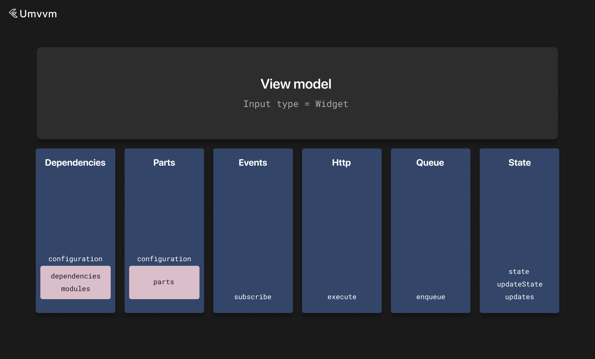

# ViewModel



View models contain logic for view classes.

They also contain local state that we like <b>Interactor</b> can update with <b>updateState</b>.

We also can listen to state changes with <b>updates</b> or <b>changes</b> methods.

There is also <b>wrapUpdates</b> method that returns <b>Stream</b> for given mapper and also exposes current value - it simplifies work with <b>StreamBuilder</b> - instead of creating <b>Stream</b> getter with <b>updates</b> method and getter for current value you can use this method to get object that wraps this getters and you can use <b>stream</b> field and <b>current</b> getter. And also there is a <b>wrapChanges</b> analogue for <b>changes</b> method.

You also need to specify input widget type for view models. It is passed as generic argument.

Input is always available via <b>input</b> field.

View models also can depend on [interactors](./interactor.md) and [wrappers](./wrapper.md) (or [custom](./custom_instance.md) instances) via <b>dependencies</b> field in configuration object.

View models also can contain [parts](./instance_part.md) via <b>parts</b> field in configuration object.

View models also can belong to modules via <b>modules</b> field in configuration object (information about modules can be found [here](./di.md)).

They are connected with <b>Connector</b> objects (more information about connectors can be found [here](./connectors.md) and for DI [here](./di.md)).

View models like every mvvm instance can receive <b>EventBus</b> events using <b>subscribe</b> method.

More information about event bus can be found [here](./event_bus.md).

To get local instances connected to view model use <b>getLocalInstance<T>()</b>.

To get part "../docs"use <b>useInstancePart<T>()</b> method.

View models also can override <b>onLaunch</b> method that is called on initState 
and <b>onFirstFrame</b> that is called on first post frame callback of corresponding view.

```dart
class PostsListViewModel extends BaseViewModel<PostsListView, PostsListViewState> {
  @override
  DependentMvvmInstanceConfiguration get configuration =>
    DependentMvvmInstanceConfiguration(
      dependencies: [
        app.postsInteractorConnector(isLazy: true),
        app.postInteractorConnector(scopes: BaseScopes.unique),
        app.reactionsWrapperConnector(),
      ],
      parts: [
        app.connectors.downloadUserPartConnector(
          input: input.id,
          isAsync: true,
        ),
        app.connectors.followUserPartConnector(input: input.id),
      ],
    );

  late final postsInteractor = getLocalInstance<PostsInteractor>();
  late final reactionsWrapper = getLocalInstance<ReactionsWrapper>();

  late final downloadUser = useInstancePart<DownloadUserPart>();
  late final followUser = useInstancePart<FollowUserPart>();

  @override
  void onLaunch(PostsListView widget) {
    // called with initState
    getLocalInstance<PostsInteractor>().loadPosts(0, 30);
  }

  @override
  void onFirstFrame(SearchView widget) {
    // called with first frame - post frame callback
  }

  @override
  void onRestore(Map<String, dynamic> savedStateObject) {
    updateState(HomeViewState.fromJson(savedStateObject));
  }

  void like(int id) {
    postsInteractor.likePost(id);
  }

  void openPost(Post post) {
    app.navigation.routeTo(app.navigation.routes.post(id: '1'));
  }

  late final posts = postsInteractor.wrapUpdates((state) => state.posts);

  @override
  PostsListViewState get initialState => PostsListViewState();

  @override
  Map<String, dynamic> get savedStateObject => state.toJson();

  @override
  StateFulInstanceSettings get stateFulInstanceSettings =>
      StateFulInstanceSettings(
        stateId: state.runtimeType.toString(),
        isRestores: true,
        syncRestore: false,
      );

  @override
  List<EventBusSubscriber> subscribe() => [
      on<PostLikedEvent>((event) {
        _onPostLiked(event.id);
      }),
    ];
}
```

View models also have <b>savedStateObject</b> and it also later can be restored with <b>onRestore</b>.

By default state key for saved object is equal to state runtime type string, but you can override it with <b>stateId</b> field in <b>stateFulInstanceSettings</b>.
If app uses obfuscation this is <b>required</b>.

In the example above we also specify <b>syncRestore</b> option. If this option set to true state will be restored from cache during <b>initialize</b> call.
Otherwise it will be restored asynchronously.

There is also ability to execute code in synced queue - meaning that if there are currently running operations - new code will be executed after all previous operations comleted - otherwise operation will be executed instantly

By default if view model is disposed all pending operation are discarded, but it can be changed with <b>discardOnDispose</b> flag
Also you can provide optional timeout for this operation

```dart
class PostsListViewModel extends BaseViewModel<PostsListView, PostsListViewState> {
  Future<void> loadPosts(int offset, int limit, {bool refresh = false}) async {
    enqueue(operation: () async {
      updateState(state.copyWith(posts: LoadingData()));

      late Response<List<Post>> response;

      if (refresh) {
        response = await app.apis.posts.getPosts(0, limit).execute();
      } else {
        response = await app.apis.posts.getPosts(offset, limit).execute();
      }

      if (response.isSuccessful || response.isSuccessfulFromDatabase) {
        updateState(state.copyWith(posts: SuccessData(response.result ?? [])));
      } else {
        updateState(state.copyWith(posts: ErrorData(response.error)));
      }
    })
  }
}
```

To see base settings and methods of view models you can visit [this page](./mvvm_instance.md).