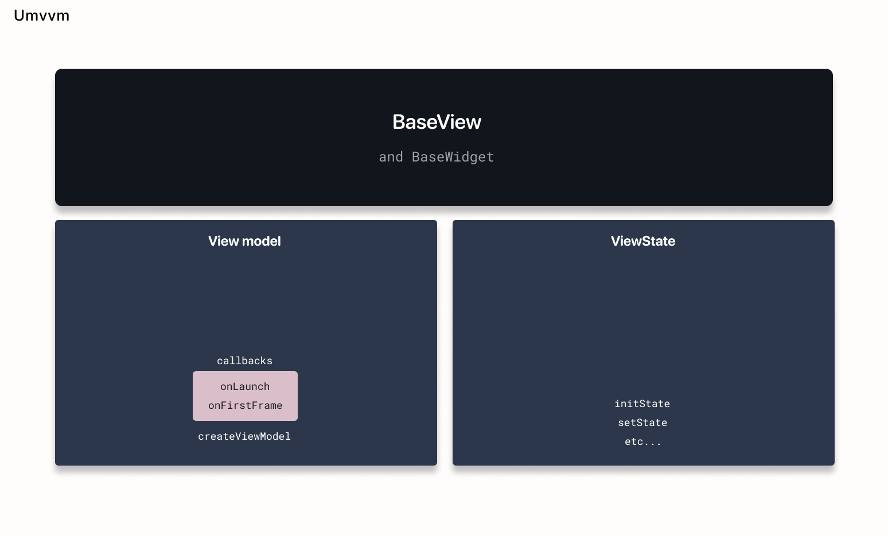

# Widget and View State



View state has a reference to the view model and a method to create the view model.

If you need to pass a mocked view model, extend `BaseWidget` instead of `StatefulWidget`.

If a view model is passed to a `BaseWidget` child class, it will be provided to the view state and the default one won't be created.

Example:

```dart
class PostsListView extends BaseWidget {
  const PostsListView({
    super.key,
    super.viewModel,
  });

  @override
  State<StatefulWidget> createState() {
    return _PostsListViewWidgetState();
  }
}

class _PostsListViewWidgetState extends BaseView<PostsListView, PostsListViewState, PostsListViewModel> {
  @override
  Widget buildView(BuildContext context) {
    return Scaffold(
      backgroundColor: const Color.fromARGB(255, 232, 232, 232),
      appBar: AppBar(
        title: const Text('Posts'),
      ),
      body: UmvvmStreamBuilder<StatefulData<List<Post>>?>(
        streamWrap: viewModel.posts,
        builder: (context, snapshot) {
          if (snapshot.hasData && snapshot.data != null) {
            return buildList(snapshot.data!);
          }

          return Container();
        },
      ),
    );
  }

  Widget buildList(StatefulData<List<Post>> data) {
    return data.when(
      result: (List<Post> value) {
        return ListView.builder(
          itemBuilder: (context, index) {
            final item = value[index];

            return PostCard(
              onTap: () {
                viewModel.openPost(item);
              },
              onLikeTap: () {
                viewModel.like(item.id ?? 1);
              },
              title: item.title ?? '',
              body: item.body ?? '',
              isLiked: item.isLiked,
            );
          },
          itemCount: value.length,
        );
      },
      loading: () {
        return const Center(child: CircularProgressIndicator());
      },
      error: (dynamic message) {
        return Text(message.toString());
      },
    );
  }

  @override
  PostsListViewModel createViewModel() {
    return PostsListViewModel();
  }
}
```

You can pass a mocked view model in the `viewModel` input parameter of `BaseWidget`.