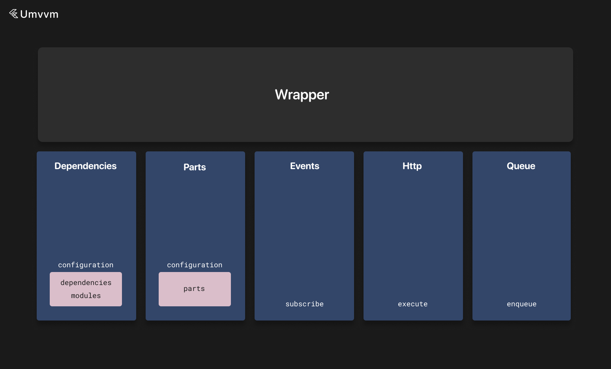

# Wrappers



Wrappers contain logic for working with third-party dependencies.

Wrappers can be used as instance holders or contain logic for working with third-party APIs.

You also need to specify the input type for wrappers. It is passed as a generic argument.

Input is always available via the `input` field.

Wrappers can be singleton or default instances.

Unlike interactors, wrappers don't have state, but they can receive `EventBus` events.

More information about `EventBus` can be found [here](./event_bus.md).

We don't need to write dependencies in our instances for singleton wrappers and we can access them with `app.instances`.

Wrappers can also depend on other [interactors](./interactor.md) and wrappers (or [custom](./custom_instance.md) instances) via the `dependencies` field in the configuration object.

The configuration object is provided via the `configuration` getter for every dependent wrapper.

Wrappers can also contain [parts](./instance_part.md) via the `parts` field in the configuration object.

Wrappers can also belong to modules (you can read about modules [here](./di.md)) via the `modules` field in the configuration object.

They are connected with `Connector` objects (more information about connectors can be found [here](./connectors.md)).

A typical example would be:

```dart
// String - input type
@basicInstances
class StripeWrapper extends BaseWrapper<String> {
}
```

Here is an example of declaration of all types of dependencies:

```dart
@singleton
class StringWrapper extends BaseWrapper<Map<String, dynamic>> {
  @override
  DependentMvvmInstanceConfiguration get configuration =>
    DependentMvvmInstanceConfiguration(
      dependencies: [
        const Connector(type: SupportInteractor, scope: BaseScopes.unique),
        const Connector(type: ReactionsWrapper),
      ],
      modules: [
        Modules.test,
      ],
      parts: [
        const PartConnector(type: TestInstancePart1, input: 5, isAsync: true),
        const PartConnector(
            type: TestInstancePart2,
            isAsync: true,
            count: 2,
            input: 10,
        ),
        PartConnector(
            type: TestInstancePart3,
            count: 2,
            inputForIndex: (index) => index + 1,
        ),
        PartConnector(
            type: TestInstancePart4,
            isAsync: true,
            count: 2,
            inputForIndex: (index) => index + 1,
        ),
        const PartConnector(
            type: TestInstancePart5,
            withoutConnections: true,
        ),
      ],
    );

  late final supportInteractor = getLocalInstance<SupportInteractor>();
  late final reactionsWrapper = getLocalInstance<ReactionsWrapper>();

  late final testInstancePart1 = useInstancePart<TestInstancePart1>();

  @override
  List<EventBusSubscriber> subscribe() => [
      on<PostLikedEvent>((event) {
        _onPostLiked(event.id);
      }),
    ];
}
```

There is also the ability to execute code in a synced queue — meaning that if there are currently running operations, new code will be executed after all previous operations are completed. Otherwise, the operation will be executed instantly.

By default, if a wrapper is disposed, all pending operations are discarded, but this can be changed with the `discardOnDispose` flag. You can also provide an optional timeout for this operation.

```dart
@singleton
class StringWrapper extends BaseWrapper<Map<String, dynamic>> {
  Future<void> loadPosts(int offset, int limit, {bool refresh = false}) async {
    enqueue(operation: () async {
      late Response<List<Post>> response;

      if (refresh) {
        response = await app.apis.posts.getPosts(0, limit).execute();
      } else {
        response = await app.apis.posts.getPosts(offset, limit).execute();
      }

      // Process response
    })
  }
}
```

Instances can then be obtained using `app.instances.get<T>()` or `getLocalInstance` methods. More information about these methods can be found [here](./di.md).

To see base settings and methods of wrappers, you can visit [this page](./mvvm_instance.md).