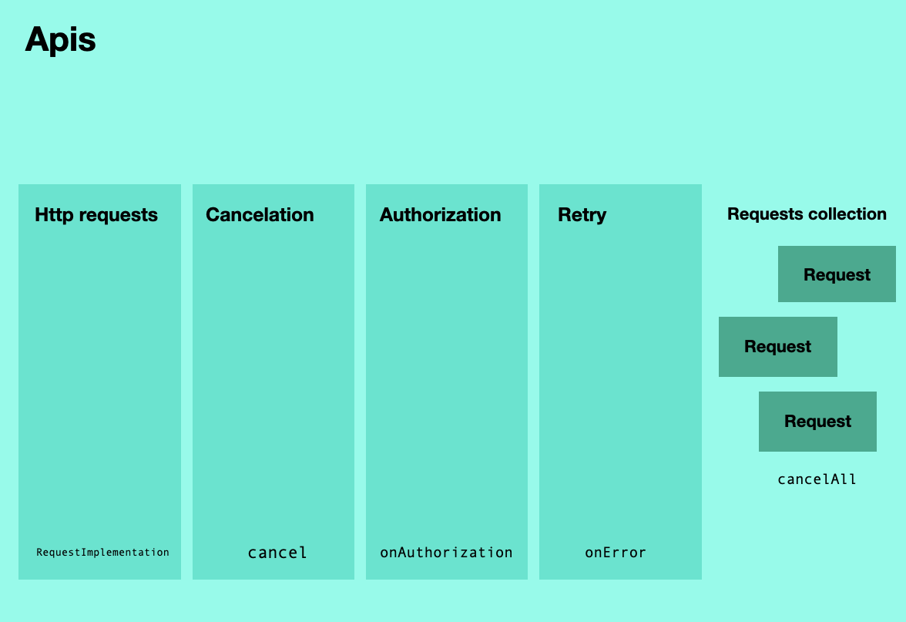

# Apis



Definition of api consists of implementing base http request class and defining api declaration.

### Base request class

Library contains default implementation of interface for [Dio](https://pub.dev/packages/dio).

To use this method firstly you need to subclass <b>DioRequest</b>.

Generic parameter here represents type of object to be returned from request after parsing.

```dart
class HttpRequest<T> extends DioRequest<T> {
  @override
  RequestSettings get defaultSettings => RequestSettings(
        logPrint: (message) {
          if (kDebugMode) {
            print(message);
          }
        },
        exceptionPrint: (error, trace) {
          if (kDebugMode) {
            print(error);
            print(trace);
          }
        },
      );

  @override
  void onAuthorization(Dio dio) {
    if (token != null) {
      dio.options.headers['Authorization'] = 'Bearer $token';
    }
  }

  @override
  Future onError(DioException error, RetryHandler retry) async {
    return error;
  }
}
```

Here you can provide default settings for all requests.

Besides parameters above you can specify default base url, default headers and default additional interceptors for requests.

You also can specify authorization callback to add required headers to requests.

And also you can specify error callback, where you can return error, or call retry handler.

You can then use this requests as follows:

```dart
Future<void> loadPosts(int offset, int limit, {bool refresh = false}) async {
    updateState(state.copyWith(posts: LoadingData()));

    late Response<List<Post>> response;

    if (refresh) {
      response = await Apis.posts.getPosts(0, limit).execute();
    } else {
      response = await Apis.posts.getPosts(offset, limit).execute();
    }

    if (response.isSuccessful) {
      updateState(state.copyWith(posts: SuccessData(response.result ?? [])));
    } else {
      updateState(state.copyWith(posts: ErrorData(response.error)));
    }
}
```

You can later cancel request with <b>cancel</b> method:

```dart
Future<void> loadPosts(int offset, int limit, {bool refresh = false}) async {
    updateState(state.copyWith(posts: LoadingData()));

    late Response<List<Post>> response;

    final request = Apis.posts.getPosts(0, limit);

    unawaited(request.execute());

    request.cancel();
}
```

### Api declaration

Api classes represent api declarations for this app.

Tipically every api represents some service on backend.

Api class contains getters or functions that return <b>BaseRequest</b>.

Api classes must be annotated with <b>api</b> annotation.

<b>HttpRequest</b> has following fields:

```dart
this.method = RequestMethod.get,
this.url,
this.parser,
this.file,
this.query,
this.timeout = const Duration(seconds: 20), // connectTimeout + receiveTimeout
this.headers = const {},
this.body,
this.baseUrl,
this.requiresLogin = true,
this.databaseGetDelegate,
this.databasePutDelegate,
this.simulateResponse,
this.simulateResult,
this.formData,
this.ignoreCancelations = false,
this.onPrefetchFromDatabase,
this.additionalInterceptors = const [],
```

Important notes here:

1) <b>parser</b> is a function that takes server response body and headers;
2) <b>simulateResponse</b> lets you simulate unparsed server response body and headers so you can check parser function and database delegates;
3) <b>simulateResult</b> lets you simulate parsed server response, so you can check interactors and view models;
4) If <b>body</b> is <b>Map</b> or <b>List</b> it will be ecoded to json automatically.

Typical example for Api class would be:

```dart
@api
class PostsApi {
  HttpRequest<List<Post>> getPosts(int offset, int limit) => HttpRequest<List<Post>>()
    ..method = RequestMethod.get
    ..baseUrl = getBaseUrl(BackendUrls.main)
    ..url = '/posts'
    ..parser = (result, headers) async {
      final list = <Post>[];

      result?.forEach((data) {
        list.add(Post.fromJson(data));
      });

      return list;
    };
}
```

Typical example of Api mocks for tests:

```dart
class MockPostsApiResponse extends PostsApi {
  @override
  HttpRequest<List<Post>> getPosts(int offset, int limit) => super.getPosts(offset, limit)
    ..simulateResponse = SimulateResponse(
      data: [{'id': 1, 'title': 'qwerty', "body": 'qwerty' }],
    );
}

class MockPostsApiResult extends PostsApi {
  @override
  HttpRequest<List<Post>> getPosts(int offset, int limit) => HttpRequest<List<Post>>()
    ..simulateResult = Response(code: 200, result: [
      Post(
        title: '',
        body: '',
        id: 1,
      )
    ]);
}
```

More information about testing can be found [here](./testing.md).

### Database or cache delegates

If project requires database we can use any database such as <b>ObjectBox</b> or <b>Hive</b> or <b>Isar</b> library and add delegates to <b>HttpRequest</b> if needed.

Here is an example:

```dart
HttpRequest<List<Post>> getPosts(int offset, int limit) => HttpRequest<List<Post>>()
    ..method = RequestMethod.get
    ..baseUrl = getBaseUrl(BackendUrls.main)
    ..url = '/posts'
    ..parser = (result, headers) async {
        final list = <Post>[];

        result?.forEach((data) {
          list.add(Post.fromJson(data));
        });

        return list;
    }
    ..databaseGetDelegate = ((headers) => PostsBox.getPostsDelegate(offset, limit, headers))
    ..databasePutDelegate = ((result) => PostsBox.putPostsDelegate(result));
```

Where delegates looks like:

```dart
class PostsBox {
  static Future<List<Post>> getPostsDelegate(int offset, int limit, Map? headers) async {
    final postsBox = App.objectBox.store.box<Post>();

    final query = postsBox.query().build();

    query
      ..offset = offset
      ..limit = limit;

    final List<Post> posts = query.find();

    return posts;
  }

  static Future putPostsDelegate(List<Post> result) async {
    final postsBox = App.objectBox.store.box<Post>();

    postsBox.putMany(result);
  }
}
```

Here for example we created class with static methods but this can be done with custom <b>MvvmInstance</b>.

More info about custom mvvm instances can be found [here](./custom_instances.md).

After you initialized all request fields you can use it as follows:

```dart
Future<void> loadPosts(int offset, int limit, {bool refresh = false}) async {
    updateState(state.copyWith(posts: LoadingData()));

    late Response<List<Post>> response;

    if (refresh) {
      response = await Apis.posts.getPosts(0, limit).execute();
    } else {
      response = await Apis.posts.getPosts(offset, limit).execute();
    }

    if (response.isSuccessful || response.isSuccessfulFromDatabase) {
      updateState(state.copyWith(posts: SuccessData(response.result ?? [])));
    } else {
      updateState(state.copyWith(posts: ErrorData(response.error)));
    }
}
```

### Authorization and errors

To process errors and retry requests override onError method.

Using instance of <b>requestsCollection</b> you can cancel all current requests and retry all of them.

```dart
await requestCollection.cancelAllRequests(
  retryRequestsAfterProcessing: true,
  cancelReasonProcessor: () async {
    await authorizationInteractor.requestNewToken(reAuth: true);
  },
);
```

You can pass cancel reason processor future and <b>retryRequestsAfterProcessing</b> flag and in this case all currently running requests in app will be paused while <b>cancelReasonProcessor</b> is executing and then will be retried without errors, if this flag don't passed then all currently running requests will be canceled with canceled error.

Here is an example:

```dart
class HttpRequest<T> extends DioRequest<T> {
  @override
  RequestSettings get defaultSettings => RequestSettings(
        logPrint: (message) {
          if (kDebugMode) {
            print(message);
          }
        },
        exceptionPrint: (error, trace) {
          if (kDebugMode) {
            print(error);
            print(trace);
          }
        },
      );

  @override
  void onAuthorization(Dio dio) {
    if (!requiresLogin) {
      return;
    }

    final token = app.instances
        .get<AuthorizationInteractor>()
        .state
        .token;

    if (token != null) {
      dio.options.headers['Authorization'] = 'Bearer $token';
    }
  }

  @override
  Future onError(DioException error, RetryHandler retry) async {
    if (error.type == DioExceptionType.cancel) {
      return error;
    }

    if (error.response?.statusCode == 401) {
      final authorizationInteractor =
          app.instances.get<AuthorizationInteractor>();

      await requestCollection.cancelAllRequests(
        retryRequestsAfterProcessing: true,
        cancelReasonProcessor: () async {
          await authorizationInteractor.requestNewToken(reAuth: true);
        },
      );

      if (!authorizationInteractor.isAuthorized) {
        return error;
      }

      return retry();
    }

    return error;
  }
}
```

### Cancelation in ApiCallers

View models, interactors and wrappers cancel all running requests when they are disposed.

This is because they contain <b>ApiCaller</b> mixin.

To enable this behaviour execute requests with <b>executeAndCancelOnDispose</b> method inside this instances or custom Api callers.

```dart
// before
response = await app.apis.posts.getPosts(0, limit).execute();

//after
response = await executeAndCancelOnDispose(app.apis.posts.getPosts(0, limit));
```

If you do not want to cancel request - for example if it is some important POST request - use request as usual.

More info about custom api callers can be found [here](./custom_instances.md).
