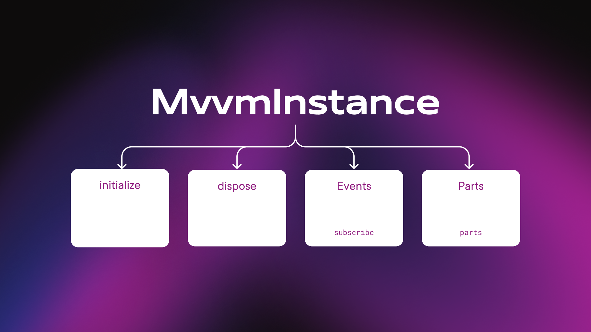

# Mvvm instance



Mvvm instance is base class for every umvvm component.

It contains simple interface with initialize and dispose methods.

Every mvvm instance is connected to global event bus so in every mvvm instance you can subscribe to events.
More infomation about event bus can be found [here](./event_bus.md).

And every mvvm instance can contain parts.
More infomation about instance parts can be found [here](./instance_part.md).

So you can add them via via <b>parts</b> field in configuration object and then call <b>useInstancePart<T>()</b> method.

Configuration object provided via <b>configuration</b> getter for every mvvm instance.

Interactors, wrappers, instance parts and view models - all of them extend <v>MvvmInstance</b>.

If you extended <b>MvvmInstance</b> you can mark child classes with DI annotations and use them with <b>app.instances</b> interface.
More infomation about DI can be found [here](./di.md).

Here is an example of simple custom mvvm instance that you can create:

```dart
abstract class BaseBox extends MvvmInstance<dynamic> {
  String get boxName;

  late final hiveWrapper = app.instances.get<HiveWrapper>();

  @mustCallSuper
  @override
  void initialize(dynamic input) {
    super.initialize(input);

    // you must set this flag to true at the end of initialization
    // if custom instance has no initialization just override initialize method and set value to true
    initialized = true;
  }

  @mustCallSuper
  @override
  void dispose() {
    super.dispose();

    // you must set this flag to false at the end of dispose process
    // if custom instance has no dispose actions just override dispose method and set value to false
    initialized = false;
  }
}
```

Then you can use it in child classes and receive events, connect parts and etc..

```dart
@basicInstance
class UsersBox extends BaseBox {
  @override
  MvvmInstanceConfiguration get configuration =>
    MvvmInstanceConfiguration(
      parts: [
        const PartConnector(type: TestInstancePart1, input: 5, isAsync: true),
        const PartConnector(
            type: TestInstancePart2,
            isAsync: true,
            count: 2,
            input: 10,
        ),
        PartConnector(
            type: TestInstancePart3,
            count: 2,
            inputForIndex: (index) => index + 1,
        ),
        PartConnector(
            type: TestInstancePart4,
            isAsync: true,
            count: 2,
            inputForIndex: (index) => index + 1,
        ),
        const PartConnector(
            type: TestInstancePart5,
            withoutConnections: true,
        ),
      ],
    );

  late final testInstancePart1 = useInstancePart<TestInstancePart1>();

  @override
  List<EventBusSubscriber> subscribe() => [
      on<PostLikedEvent>((event) {
        _onPostLiked(event.id);
      }),
    ];
}
```

Every mvvm instance also can be async. In this case you need to specify <b>isAsync</b> flag in configuration object. And also you can override <b>initializeAsync</b> method.

Here is an example:

```dart
@basicInstance
class UsersBox extends BaseBox {
  @override
  MvvmInstanceConfiguration get configuration =>
    MvvmInstanceConfiguration(
      parts: [
        const PartConnector(type: TestInstancePart1, input: 5, isAsync: true),
      ],
      isAsync: true,
    );

  late final testInstancePart1 = useInstancePart<TestInstancePart1>();

  @override
  Future<void> initializeAsync() async {
    await super.initializeAsync();

    // ...
  }

  @override
  List<EventBusSubscriber> subscribe() => [
      on<PostLikedEvent>((event) {
        _onPostLiked(event.id);
      }),
    ];
}
```